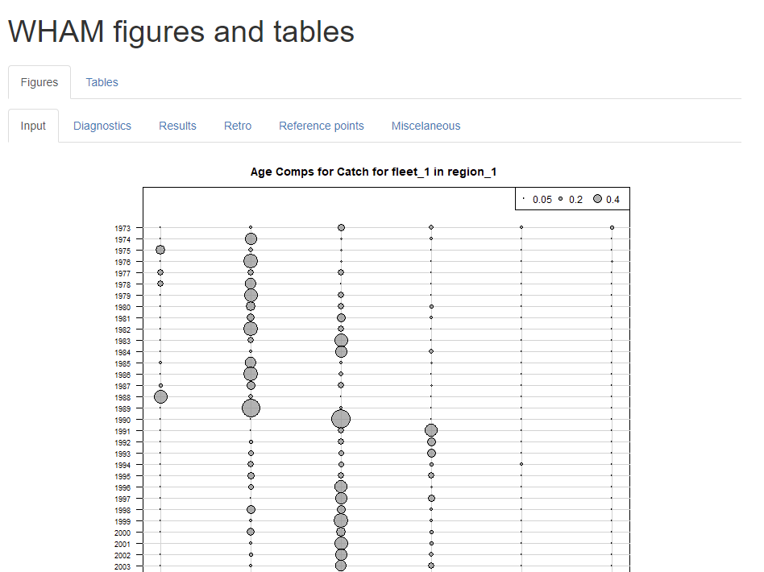
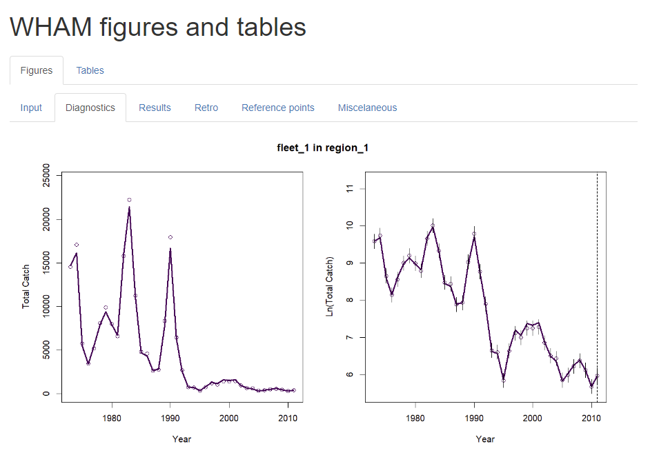
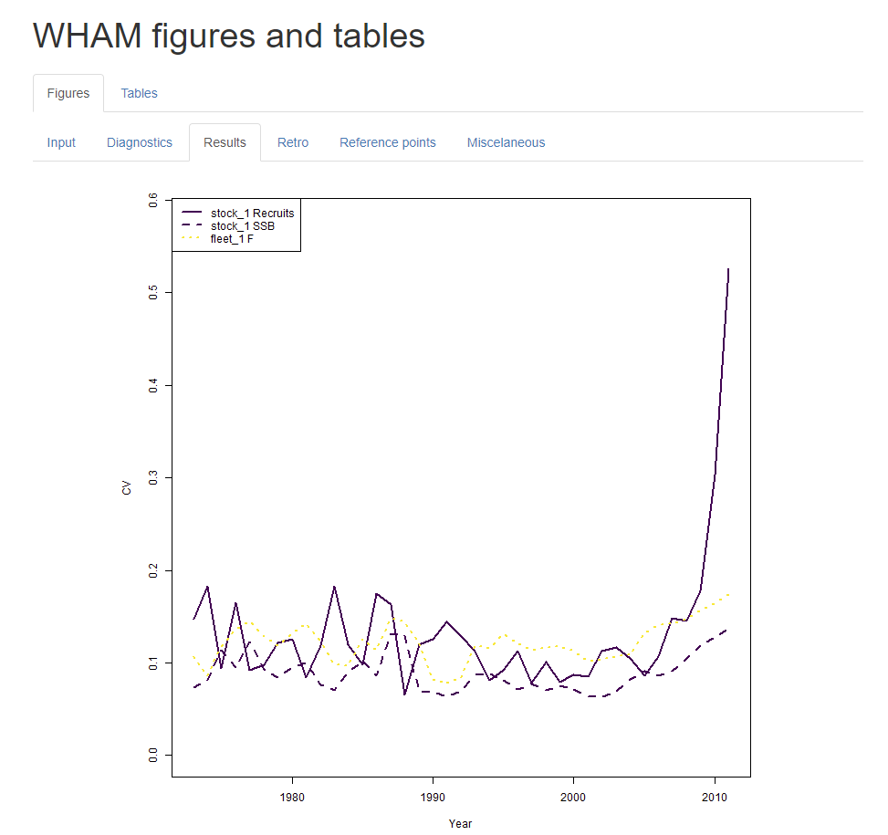
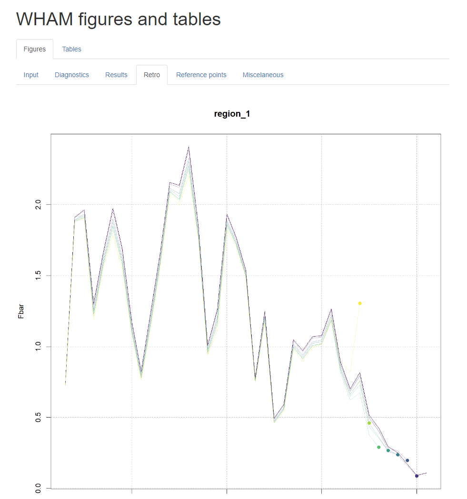
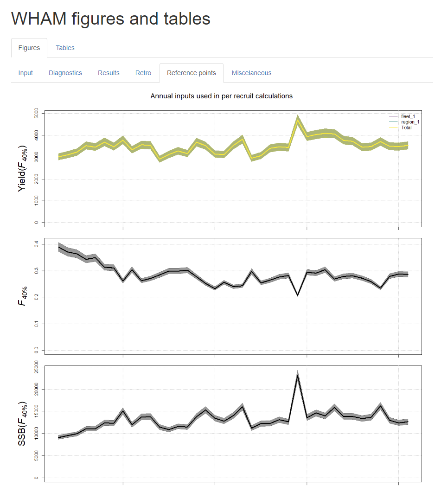
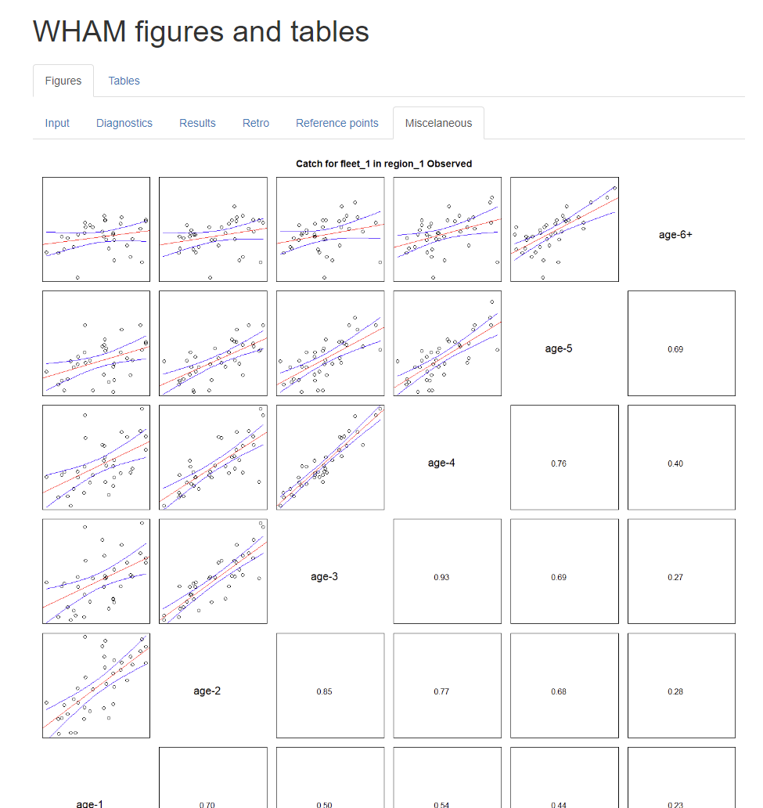
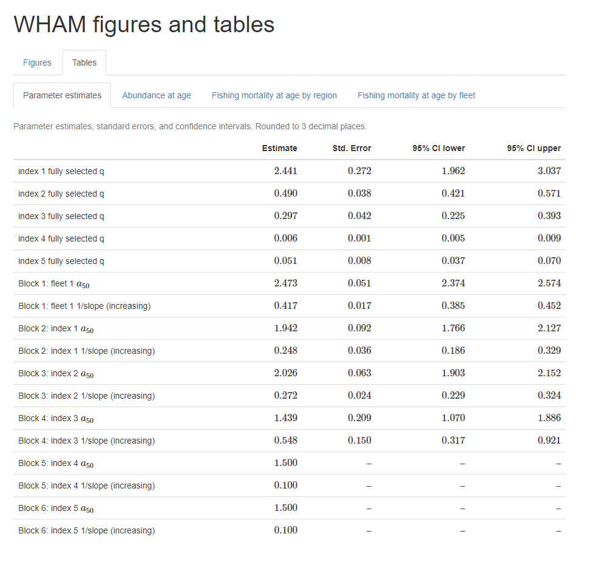
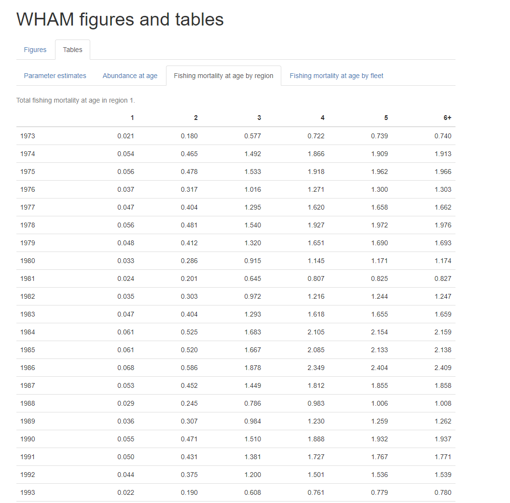

layout: true

.footnote[U.S. Department of Commerce | National Oceanic and Atmospheric Administration | National Marine Fisheries Service]


<style type="text/css">

code.cpp{
  font-size: 14px;
}
code.r{
  font-size: 14px;
}


</style>

```{css, echo=FALSE}
pre {
  max-height: 250px; /*changes height of chunk output box*/
  max-width: 800px; /*changes width of chunk output box*/
  overflow-y: auto; /* auto will add vertical scroll bar when necessary */
}

```


```{r setup, include=FALSE}
#options(htmltools.dir.version = FALSE)
#library(knitr)
#knitr::opts_chunk$set(cache = TRUE)
#knitr::opts_knit$set(root.dir = here::here())
#knitr::opts_chunk$set(width = 1500)
#library(kableExtra)
#library(imager)
#here::i_am("c:/work/BSB_RT")

#library(here)

```

```{r set-options, include = FALSE}
options(width = 50)
```

```{r xaringan-tile-view, echo=FALSE}
# this gives you a tile navigation if you type "O" at any time
#xaringanExtra::use_tile_view()
```

---
# Outline <br>

* Fitting a model with WHAM
 * Elements of an unfit model
 * Doing a basic fit
 * Calculating reference points: `do.brps = TRUE`
 * Calculating parameter uncertainty: `do.sdrep = TRUE`
 * Fitting Retrospective peels: `do.retro = TRUE`
 * Calculating One-step-ahead residuals: `do.osa = TRUE`
 * elements of a fitted model object
* Plots and Tables: `plot_wham_output`
---

# Fitting the model <br>

We will work off of the same input and fit using the `ex2_SNEMAYT.dat` input.

```{r, include = FALSE}
library("wham", lib.loc = "c:/work/wham/old_packages/lab")
path_to_examples <- system.file("extdata", package="wham")
asap3 <- read_asap3_dat(file.path(path_to_examples,"ex2_SNEMAYT.dat"))
input_asap <- prepare_wham_input(asap3) 
```

```{r, eval = FALSE}
library(wham)
path_to_examples <- system.file("extdata", package="wham")
asap3 <- read_asap3_dat(file.path(path_to_examples,"ex2_SNEMAYT.dat"))
input_asap <- prepare_wham_input(asap3) 
```

---

# Model object elements: An unfit model
```{r, include = FALSE}
nofit_asap <- fit_wham(input_asap, do.fit = FALSE)
```
```{r, eval = FALSE}
nofit_asap <- fit_wham(input_asap, do.fit = FALSE)
```
```{r, eval = TRUE}
names(nofit_asap)
```
The first 10 elements of the unfit model object are produced by  the call to `TMB::MakADFun`. The important parts for us are:
* `par`: the initial values of the fixed effects parameters that will be estimated if `do.fit=TRUE`
* `fn`: The function of `par` that calculates the negative log-likelihood. Minimized by `nlminb` if `do.fit = TRUE`
* `gr`: The function of `par` that calculates the gradient of the negative log-likelihood function. Used by `nlminb` to search for the minimum.
* `report`: A function of `par` that generates a list of variables the C++ code  to provide given the value of `par`.
* `simulate`: A function of `par` that will simulate any variables and observations the C++ code is specified to simulate given teh value of `par`

---

# Model object elements: An unfit model

Other non-TMB elements:
* `input`: the wham input that was passed to `fit_wham`.
* `years`, `years_full`, `ages.lab` are copied from the input.
* `model_name`: anything provided by the argument to `fit_wham` of the same name.
* `call`: the expression for the call to `fit_wham`
* `wham_commit`,`wham_version`: stores the git commit and release version of the package that is being used.
* `TMB_commit`,`TMB_version`: stores the git commit and release version of the TMB package that is being used.
* `rep`: the list of reported variables returned by nofit_asap3$report(). Analogous to the `*.rep` files produced using ADMB.
* `is_sdrep`: logical flag of whether TMB::sdreport() has been called for this model. Should be FALSE for an unfit model.
* `parList`: list of all parameter values (whether used or not) that is identical in structure to the list of `input$par`

---

# A basic call to fit_wham
```{r, include = FALSE}
fit_asap <- fit_wham(input_asap, do.retro = FALSE, do.osa = FALSE, do.sdrep = FALSE)
```
The most minimal use of fit_wham turns off all post-fitting features:
```{r, eval = FALSE}
fit_asap <- fit_wham(input_asap, do.retro = FALSE, do.osa = FALSE, do.sdrep = FALSE, do.brps = FALSE)
```
```{r, eval = TRUE}
names(fit_asap)
```
Further elements added by fitting
* `opt`: the results returned the call to `nlminb`, par, objective, convergence, etc.
* `date`: date/time the fit was completed.
* `dir`: the directory where the fit was completed.
* `final_gradient`: the gradient vector at the minimized nll
* `na_sdrep`: whether any of the standard errors for parameter estimates are NA.
* `runtime`: how long it took to perform the fit

---

# Calculating standard errors

Starting in WHAM version 1.2.0, it is easy to add standard error estimation to a model that has already been fit:
```{r, include = FALSE}
fit_asap <- do_sdreport(fit_asap)
```
```{r, eval = FALSE}
fit_asap <- do_sdreport(fit_asap)
```
```{r, eval = TRUE}
names(fit_asap)
```
There is an `sdrep` component that is the object returned by `TMB::sdreport()`

---

# Calculating standard errors
`sdrep` give parameter estimates and standar errors.
```{r, eval = TRUE}
fit_asap$sdrep
```

---

# Calculating standard errors

There is a handy TMB function for putting parameter estimates and standard errors in their proper structure:
```{r}
par_est_list <- TMB:::as.list.sdreport(fit_asap$sdrep, what = "Est")
par_se_list <-TMB:::as.list.sdreport(fit_asap$sdrep, what = "Std")
rep_est_list <- TMB:::as.list.sdreport(fit_asap$sdrep, what = "Est", report = TRUE)
rep_se_list <- TMB:::as.list.sdreport(fit_asap$sdrep, what = "Std", report = TRUE)
```
If TMB is loaded
```{r, eval = FALSE}
library(TMB)
par_est_list <- as.list(fit_asap$sdrep, what = "Est")
```

---

# Calculating standard errors

`log_NAA` is an array (n_stocks x n_regions x n_years x n_ages) of parameters for log abundance at age.

For this model, annual recruitments are the only estimated parameters (as fixed effects).
```{r}
dim(par_est_list$log_NAA)
par_est_list$log_NAA[1,1,1:5,]
par_se_list$log_NAA[1,1,1:5,]
```
The log abundance at ages older than 1 do not have a standard error estimated because they are fixed and unused.

---

# Other post-fit results
```{r, include = FALSE, eval = FALSE}
fit_asap <- do_reference_points(fit_asap, do.sdrep = TRUE)
fit_asap$peels <- retro(fit_asap)
fit_asap <- make_osa_residuals(fit_asap)
```
Starting in WHAM version 1.2.0, it is easy to add reference reporting to a model that has already been fit:
```{r, eval = FALSE}
fit_asap <- do_reference_points(fit_asap, do.sdrep = TRUE)
```

There are also functions for adding retro peels and one-step-ahead residuals
```{r, eval = FALSE}
fit_asap$peels <- retro(fit_asap)
fit_asap <- make_osa_residuals(fit_asap)
```
`make_osa_residuals` runs TMB::one_step_predict for aggregate and composition observations separately and adds those to the list of elements in `fit_asap`
---

# Plotting output

WHAM allows alternative approaches to creating files of plots and tables using `plot_wham_output`.
The default call is
```{r, eval = FALSE}
plot_wham_output(mod, dir.main = getwd(), out.type = 'html', res = 72, plot.opts = NULL)
```
* `mod` is the fitted model
* `dir.main` is the directory where save all files
* `out.type` tells whether to create html or pdf summary files, or just individual png plot files.

From version 1.2.0, `out.type = "html"` will use Rmarkdown and pandoc to create a self-contained html file of both plots and tables that can be moved, shared, and viewed at any time in a browser.

---

# Plotting output
Now run the `plot_wham_output` function on our fitted model and we'll explore the html file. We'll save all the files in a temporary directory.
```{r, eval = FALSE}
tmp.dir <- tempdir(check=TRUE)
plot_wham_output(fit_asap, dir.main = tmp.dir)
```
---

# Plotting output
```{r, echo = FALSE, out.width="60%", fig.align="center"}

```
---

# Plotting output
.pull-left[
```{r, echo = FALSE, out.width="100%", fig.align="center"}

```
]
.pull-right[
```{r, echo = FALSE, out.width="100%", fig.align="center"}

```
]
---
# Plotting output
.pull-left[
```{r, echo = FALSE, out.width="100%", fig.align="center"}

```
]
.pull-right[
```{r, echo = FALSE, out.width="100%", fig.align="center"}

```
]

---
# Plotting output
.pull-left[
```{r, echo = FALSE, out.width="100%", fig.align="center"}

```
]
.pull-right[
```{r, echo = FALSE, out.width="100%", fig.align="center"}

```
]
---

# Plotting output
.pull-left[
```{r, echo = FALSE, out.width="100%", fig.align="center"}

```
]
.pull-right[
```{r, echo = FALSE, out.width="100%", fig.align="center"}

```
]

