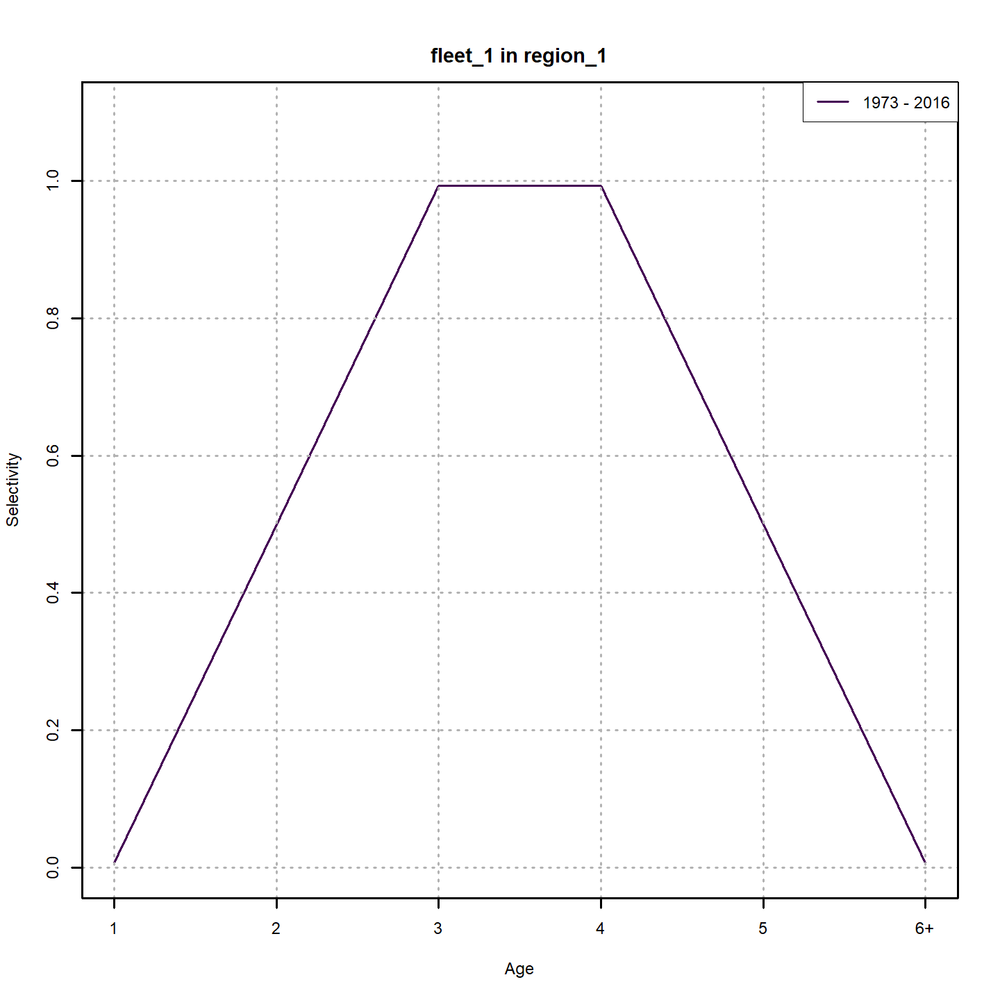
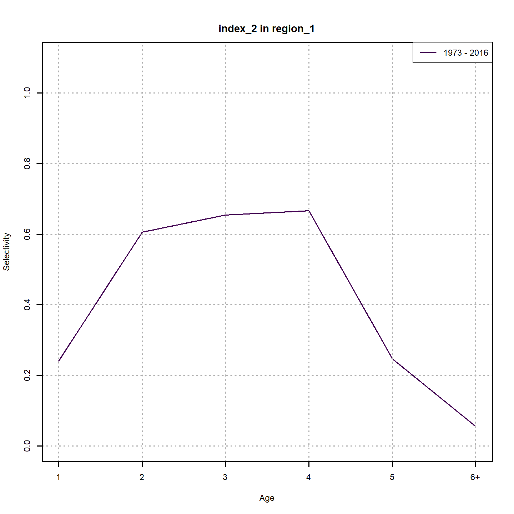
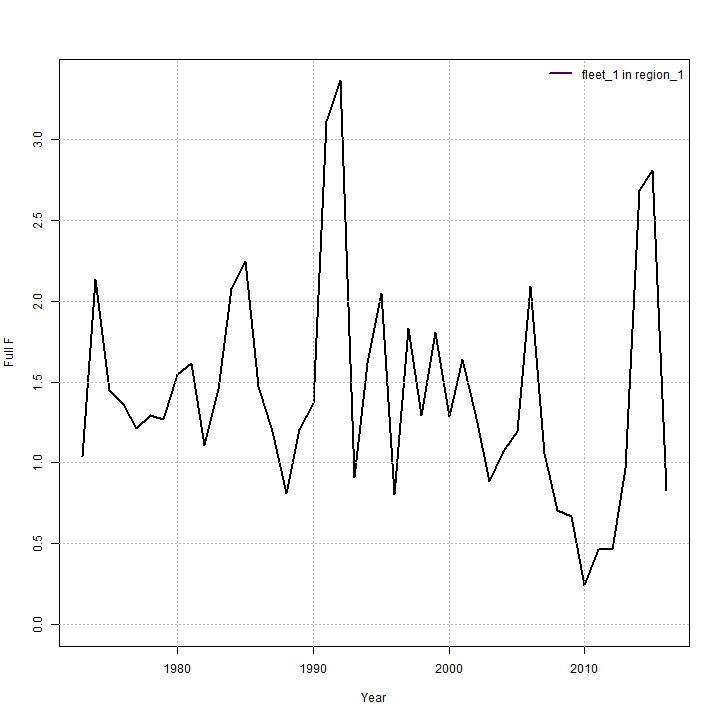

layout: true

.footnote[U.S. Department of Commerce | National Oceanic and Atmospheric Administration | National Marine Fisheries Service]


<style type="text/css">

code.cpp{
  font-size: 14px;
}
code.r{
  font-size: 14px;
}


</style>

```{css, echo=FALSE}
pre {
  max-height: 250px; /*changes height of chunk output box*/
  max-width: 800px; /*changes width of chunk output box*/
  overflow-y: auto; /* auto will add vertical scroll bar when necessary */
}

```
```{r set-options, include = FALSE}
options(width = 50)
```

```{r xaringan-tile-view, echo=FALSE}
# this gives you a tile navigation if you type "O" at any time
#xaringanExtra::use_tile_view()
```

---

# Outline <br>

* Using `set_selectivity`
* Using different options with WHAM example data
 * Different mean selectivity models
 * Using WHAM to explore age at full selection
 * Using random effects with age-specific mean model
 * Using random effects with logistic mean model

---

# Selectivity options

The selectivity argument to `prepare_wham_input` or `set_selectivity` has these elements to configure selectivity.

* `n_selblocks`: number of selectivity blocks.
* `model`: character vector specifying which of 4 options for the mean model to use for each selectivity block
 * `age-specific`: a different parameter for each age class
 * `logistic`: 2 parameters: a50 and 1/slope
 * `double-logistic`: 4 parameters: increasing a50 and 1/slope and decreasing a50 and 1/slope
 * `decreasing-logistic`: 2 parameters decreasing a50 and 1/slope
* `initial_pars`: initial values to use for each selectivity parameter
* `fix_pars`: which selectivity parameters to fix at initial values
* `par_min`, `par_max`: lower, upper bounds to use for each selectivity parameter
* `map_par`: alternative to `fix_pars` for fixing parameters or making some equal but still estimated.

---

# Selectivity options

* `re`: character vector specifying which of 5 options to model random effects for each selectivity block,
 * `none`: well, no random effects
 * `iid`: independent annual and mean parameter-specific random effects. E.g., time and age varying for `age-specific`
 * `ar1`: autocorrelated random effects for mean parameters that are constant over time
 * `ar1_y`: a single vector of annual autocorrelated random effects used for all mean parameters.
 * `2dar1`: like `iid`, but assumes different autocorrelation across mean parameters and years.
* `sigma_vals`: initial values for random effects standard deviation parameters.
* `map_sigma`: fix or estimate `sigma_vals` parameters uniquely or commonly
* `cor_vals`: initial values for random effects autocorrelation parameters.
* `map_cor`: fix or estimate `cor_vals` parameters uniquely or commonly

---

# Mean model options with example data

We will use same input and fit using the `ex1_SNEMAYT.dat` input available in WHAM.

```{r, include = FALSE}
library("wham", lib.loc = "c:/work/wham/old_packages/lab")
path_to_examples <- system.file("extdata", package="wham")
asap3 <- read_asap3_dat(file.path(path_to_examples,"ex1_SNEMAYT.dat"))
input <- prepare_wham_input(asap3)
```

```{r, eval = FALSE}
library(wham)
path_to_examples <- system.file("extdata", package="wham")
asap3 <- read_asap3_dat(file.path(path_to_examples,"ex1_SNEMAYT.dat"))
input <- prepare_wham_input(asap3)
nofit <- fit_wham(input, do.fit = FALSE)
```

```{r, eval = FALSE}
tmp.dir <- tempdir(check=TRUE)
plot_wham_output(nofit, dir.main = tmp.dir)

```

---

# Mean model options with example data

```{r, echo = FALSE, out.width="50%", fig.align="center"}

```
---

# Mean model options with example data

Now we will specify the model to use 3 different mean models for each selectivity block.
```{r, eval = FALSE}
# alternative mean models
selectivity <- list(model = c("double-logistic", "decreasing-logistic", "logistic"))
selectivity$initial_pars <- list(
	c(2,0.2,5,0.2), #ascending a50, 1/slope, and descending a50, 1/slope
	c(3, 0.2), #descending a50 and 1/slope
	c(3, 0.2)) #ascending a50, 1/slope
selectivity$fix_pars <- list(NULL, NULL, NULL) #all estimated
input_0 <- set_selectivity(input, selectivity = selectivity)
nofit_0 <- fit_wham(input_0, do.fit = FALSE)
plot_wham_output(nofit_0, dir.main = tmp.dir)

```
---

# Mean model options with example data

.three-column[
```{r, echo = FALSE, out.width="100%", fig.align="center"}

```
]
.three-column[
```{r, echo = FALSE, out.width="100%", fig.align="center"}

```
]
.three-column[
```{r, echo = FALSE, out.width="100%", fig.align="center"}

```
]

---

#Assume age-specific selectivity for fleet

We will fit a  model that lets all age-specific selectivity parameters be estimated for the fleet.
Annual Fs will also be estimated, so we do not expect convergence, but we can see which age the model thinks should be fully selected.
```{r, include = FALSE}
selectivity <- list(model = c("age-specific", "logistic", "logistic"))
selectivity$initial_pars <- list(
  rep(0.5, 6), #start all parameters in the middle
  c(3, 0.2), 
  c(3, 0.2))
selectivity$fix_pars <- list(NULL, NULL, NULL)  #all estimated

input_1 <- set_selectivity(input, selectivity = selectivity)
```
```{r, eval = FALSE}
selectivity <- list(model = c("age-specific", "logistic", "logistic"))
selectivity$initial_pars <- list(
	rep(0.5, 6), #start all parameters in the middle
	c(3, 0.2), 
	c(3, 0.2))
selectivity$fix_pars <- list(NULL, NULL, NULL)  #all estimated

input_1 <- set_selectivity(input, selectivity = selectivity)
nofit_1 <- fit_wham(input_1, do.fit = FALSE)
plot_wham_output(nofit_1, dir.main = tmp.dir)
```
```{r, eval = TRUE}
#check that all ages are estimated
temp <- input_1$par$logit_selpars
temp[] <- input_1$map$logit_selpars
temp
```
---

#Assume age-specific selectivity for fleet

.pull-left[
```{r, eval = FALSE}
fit_1 <- fit_wham(input_1, do.sdrep = FALSE, do.osa = FALSE, do.retro = FALSE)
plot_wham_output(fit_1, dir.main = tmp.dir)
```
]
.pull-right[
```{r, echo = FALSE, out.width="100%", fig.align="center"}

```
]
---

# Assume all are age-specific

What if we have age-specific selectivity for the fleet and the indices?parameters be estimated for the fleet.
Here we freely estimate the selectivity parameters for all of these to investigate each age at full selection
```{r, eval = TRUE}
selectivity$model <- rep("age-specific", 3)
selectivity$initial_pars <- list(
	rep(0.5, 6), 
	rep(0.5, 6), 
	rep(0.5, 6)) 

input_2 <- set_selectivity(input, selectivity = selectivity)
temp <- input_2$par$logit_selpars
temp[] <- input_2$map$logit_selpars
temp
```

```{r, eval = FALSE}
fit_2 <- fit_wham(input_2, do.sdrep = FALSE, do.osa = FALSE, do.retro = FALSE)
plot_wham_output(fit_1, dir.main = tmp.dir)
```
---

# Assume all are age-specific
.three-column[
```{r, echo = FALSE, out.width="100%", fig.align="center"}

```
]
.three-column[
```{r, echo = FALSE, out.width="100%", fig.align="center"}
knitr::include_graphics("day_2_1_fit_2_sel_index_1.png")
```
]
.three-column[
```{r, echo = FALSE, out.width="100%", fig.align="center"}

```
]

---

# Assume all are age-specific

Now fix selectivity at 1 for the ages at full selection

```{r, eval = FALSE}
selectivity$initial_pars <- list(
	c(0.5,0.5,0.5,1,0.5, 0.5),
	c(0.5,0.5,0.5,1,0.5, 0.5),
	c(0.5,0.5,0.5,1,0.5, 0.5))
selectivity$fix_pars <- list(4,4,4)
input_3 <- set_selectivity(input, selectivity = selectivity)

fit_3 <- fit_wham(input_3, do.sdrep = TRUE, do.osa = FALSE, do.retro = FALSE)
plot_wham_output(fit_3, dir.main = tmp.dir)
```
---

# Assume all are age-specific

.three-column[
```{r, echo = FALSE, out.width="100%", fig.align="center"}

```
]
.three-column[
```{r, echo = FALSE, out.width="100%", fig.align="center"}

```
]
.three-column[
```{r, echo = FALSE, out.width="100%", fig.align="center"}
knitr::include_graphics("day_2_1_fit_3_sel_index_2.png")
```
]

---

# Time and age-varying selectivity

We can also freely estimate time and age varying Fishing mortality.
Can be of interest to see if there are periods where the age at full selection is different.

* We force the mean of the random effects to be the same for all ages.
* Fix F at a plausible maximum value (F=5), then $FAA_{y,a} = F * sel_{y,a}$
* mean selectivity should be estimated to scale FAA appropriately.

```{r, eval = FALSE}
F_opts <- list(
	F = cbind(rep(5,input$data$n_years_model)),
	map_F = cbind(rep(NA, input$data$n_years_model)))

selectivity$re <- c("iid", "none", "none")
selectivity$fix_pars <- NULL
selectivity$initial_pars[[1]] <- rep(0.1,6)
selectivity$map_pars <- list(c(1,1,1,1,1,1),c(1:3,NA,4:5), c(1:3,NA,4:5))

input_4 <- set_selectivity(input, selectivity = selectivity)
input_4 <- set_F(input_4, F_opts)
# This one takes a while
fit_4 <- fit_wham(input_4, do.sdrep = TRUE, do.osa = FALSE, do.retro = FALSE)
plot_wham_output(fit_4, dir.main = tmp.dir)
```

---

# Time and age-varying selectivity

* Selectivity seems to generally be greatest for ages 4-5
* Highly variable and often large uncertainty in fully-selected $F$

.three-column[
```{r, echo = FALSE, out.width="100%", fig.align="center"}

```
]
.three-column[
```{r, echo = FALSE, out.width="100%", fig.align="center"}

```
]
.three-column[
```{r, echo = FALSE, out.width="100%", fig.align="center"}

```
]


---

# Time and age-varying selectivity

Now fix age at full selection at 5 for fleet selectivity

```{r, eval = FALSE}
selectivity <- list(model = rep("age-specific", 3))
selectivity$re <- c("iid", "none", "none")
selectivity$fix_pars <- NULL
selectivity$initial_pars <- list(
  c(rep(0.5,4),1,0.5),
  c(0.5,0.5,0.5,1,0.5, 0.5),
  c(0.5,0.5,0.5,1,0.5, 0.5))
selectivity$map_pars <- list(c(1,1,1,1,NA,1),c(1:3,NA,4:5), c(1:3,NA,4:5))
input_5 <- set_selectivity(input, selectivity = selectivity)
fit_5 <- fit_wham(input_5, do.sdrep = TRUE, do.osa = FALSE, do.retro = FALSE)
plot_wham_output(fit_5, dir.main = tmp.dir)
```

---

# Time and age-varying selectivity

* Selectivity seems to generally be greatest for ages 4-5
* Highly variable and often large uncertainty in fully-selected $F$

.three-column[
```{r, echo = FALSE, out.width="100%", fig.align="center"}

```
]
.three-column[
```{r, echo = FALSE, out.width="100%", fig.align="center"}

```
]
.three-column[
```{r, echo = FALSE, out.width="100%", fig.align="center"}

```
]

---

# AR1 Time-varying selectivity

Here we demonstrate an autocorrelated annual random effect applied to all ages

.pull-left[
```{r, eval = FALSE}
selectivity <- list(model = rep("age-specific", 3))
selectivity$re <- c("ar1_y", "none", "none")
selectivity$fix_pars <- NULL
selectivity$initial_pars <- list(
  c(rep(0.5,4),1,0.5),
  c(0.5,0.5,0.5,1,0.5, 0.5),
  c(0.5,0.5,0.5,1,0.5, 0.5))
selectivity$map_pars <- list(c(1:4,NA,5),c(1:3,NA,4:5), c(1:3,NA,4:5))
input_6 <- set_selectivity(input, selectivity = selectivity)
fit_6 <- fit_wham(input_6, do.sdrep = TRUE, do.osa = FALSE, do.retro = FALSE)
plot_wham_output(fit_6, dir.main = tmp.dir)
```
]
.pull-right[
```{r, echo = FALSE, out.width="100%", fig.align="center"}

```
]

---

# AR1 Age-varying selectivity

Here we demonstrate autocorrelated random effects across age, but constant across time

.pull-left[
```{r, eval = FALSE}
selectivity$re <- c("ar1", "none", "none")
selectivity$fix_pars <- NULL
selectivity$initial_pars <- list(
  c(rep(0.5,4),1,0.5),
  c(0.5,0.5,0.5,1,0.5, 0.5),
  c(0.5,0.5,0.5,1,0.5, 0.5))
selectivity$map_pars <- list(c(1,1,1,1,NA,1),c(1:3,NA,4:5), c(1:3,NA,4:5))
input_7 <- set_selectivity(input, selectivity = selectivity)
fit_7 <- fit_wham(input_7, do.sdrep = TRUE, do.osa = FALSE, do.retro = FALSE)
plot_wham_output(fit_7, dir.main = tmp.dir)
```
]
.pull-right[
```{r, echo = FALSE, out.width="100%", fig.align="center"}

```
]

# 2DAR1 age and time-varying selectivity

Here we demonstrate estimating autocorrelation across age and time

.pull-left[
```{r, eval = FALSE}
selectivity$re <- c("2dar1", "none", "none")
selectivity$fix_pars <- NULL
selectivity$initial_pars <- list(
  c(rep(0.5,4),1,0.5),
  c(0.5,0.5,0.5,1,0.5, 0.5),
  c(0.5,0.5,0.5,1,0.5, 0.5))
selectivity$map_pars <- list(c(1,1,1,1,NA,1),c(1:3,NA,4:5), c(1:3,NA,4:5))
input_8 <- set_selectivity(input, selectivity = selectivity)
fit_8 <- fit_wham(input_8, do.sdrep = TRUE, do.osa = FALSE, do.retro = FALSE)
plot_wham_output(fit_8, dir.main = tmp.dir)
```
]
.pull-right[
```{r, echo = FALSE, out.width="100%", fig.align="center"}

```
]

---

# Random effects for logistic selectivity

* it is generally not advised to try to estimate autocorrelation of parameters within a year (there are just 2 parameters)
 * this would exclude `ar1` and `2dar1` options
* we assume independent random effects for both logistic selectivity parameters

.pull-left[
```{r, eval = FALSE}
selectivity <- list(model = rep("logistic", 3))
selectivity$re <- c("iid", "none", "none")
selectivity$fix_pars <- NULL
selectivity$initial_pars <- list(
  c(3, 0.2), 
  c(3, 0.2), 
  c(3, 0.2)) 
input_9 <- set_selectivity(input, selectivity = selectivity)
fit_9 <- fit_wham(input_9, do.sdrep = TRUE, do.osa = FALSE, do.retro = FALSE)
saveRDS(fit_9, file.path("temp", "day_2_1_fit_9.RDS"))
plot_wham_output(fit_9, dir.main = tmp.dir)
```
]
.pull-right[
```{r, echo = FALSE, out.width="80%", fig.align="center"}

```
]

