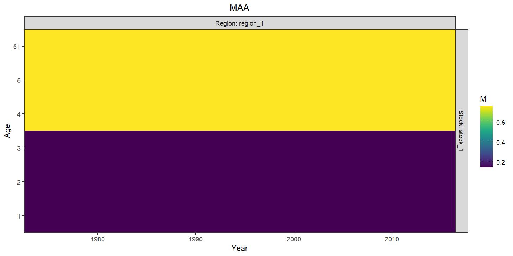

layout: true

.footnote[U.S. Department of Commerce | National Oceanic and Atmospheric Administration | National Marine Fisheries Service]


<style type="text/css">

code.cpp{
  font-size: 14px;
}
code.r{
  font-size: 14px;
}


</style>

```{css, echo=FALSE}
pre {
  max-height: 250px; /*changes height of chunk output box*/
  max-width: 800px; /*changes width of chunk output box*/
  overflow-y: auto; /* auto will add vertical scroll bar when necessary */
}

```
```{r set-options, include = FALSE}
options(width = 50)
```

```{r xaringan-tile-view, echo=FALSE}
# this gives you a tile navigation if you type "O" at any time
#xaringanExtra::use_tile_view()
```

---

# Outline <br>

* Using `set_NAA`
* Using different options with WHAM example data:
 * Different initial abundance models
 * Different NAA random effects models
 * Different mean recruitment models
* Using `set_M`
* Using different options with WHAM example data
 * Different mean M models
 * Different M random effects models
* Using `set_q`
* Using different options with WHAM example data
 * Different q random effects models
---

# Abundance at age options
The `NAA_re` argument to `prepare_wham_input` or `set_NAA` has these elements to configure various aspects of abundance at age.
* `recruit_model`: whether to estimate recruitment as
 * (1) annual fixed effects
 * (2) a mean recruitment parameter and annual random effects,
 * (3) a mean Beverton-Holt function of SSB and annual random effects
 * (4) a mean Ricker function of SSB and annual random effects
* `recruit_pars`: initial values to use for mean recruitment parameters.
* `N1_model`: character vector specifying which of 4 options for the initial abundance at age
 * `age-specific`: a different parameter for each age class
 * `equilibrium`: 2 parameters: initial recruitment and a fully-selected F needed to calculate an equilibrium distribution of abundance at age.
 * `iid-re`: Estimate a mean abundance with independent random effects for each age.
 * `ar1-re`: Estimate a mean abundance with autocrrelated random effects for each age.
* `N1_pars`: initial parameter values to use for the initial abundance at age.

---

# Abundance at age options
* `sigma`: whether to estimate random effects on recruitment only or recruitment and survival from one time step to the next.
 * `rec`: random effects for recruitment only, survival/transitions for older ages are deterministic.
 * `rec+1`: random effects for recruitment and survival/transitions for older ages
* `sigma_vals`: initial values to use for standard deviations of random effects
* `sigma_map`: to fix or estimate `sigma_vals` parameters uniquely or commonly
* `cor`: how to model auto-correlation of random effects
 * `iid`: uncorrelated by year and age
 * `ar1_y`: correlated by year, independent by age
 * `ar1_a`: correlated by age, independent by year
 * `2dar1`: correlated by year and age
* `cor_vals`: initial values to use for autocorrelation parameters
* `decouple_recruitment`: Whether to make recruitment random effects separate from those for survival transitions at older ages.

---


# Initial Abundance at age

First, load up some data:
```{r, eval = FALSE}
library("wham")
wham.dir <- find.package("wham")
path_to_examples <- system.file("extdata", package="wham")
asap3 <- read_asap3_dat(file.path(path_to_examples,"ex1_SNEMAYT.dat"))
tmp.dir <- tempdir(check=TRUE)
```
Then fit models with each of the different options for initial abundance at age:
```{r, eval = FALSE}
#default is age-specific fixed effects
input <- prepare_wham_input(asap3)
input <- set_selectivity(input, selectivity)
fit_0 <- fit_wham(input, do.retro=FALSE, do.osa=FALSE)
plot_wham_output(fit_0, dir.main = tmp.dir)

#2 fixed effects
input_1 <- set_NAA(input, NAA_re = list(N1_model = "equilibrium"))
fit_1 <- fit_wham(input_1, do.retro=FALSE, do.osa=FALSE)

#2 fixed effects
input_2 <- set_NAA(input, NAA_re = list(N1_model = "iid-re"))
fit_2 <- fit_wham(input_2, do.retro=FALSE, do.osa=FALSE)

#3 fixed effects
input_3 <- set_NAA(input, NAA_re = list(N1_model = "ar1-re"))
fit_3 <- fit_wham(input_3, do.retro=FALSE, do.osa=FALSE)

```

---

# Initial Abundance at age

.pull-left[
```{r, eval = FALSE}
N1 <- sapply(0:3, function(x) get(paste0("fit_", x))$rep$NAA[1,1,1,])
matplot(N1, type = 'l', lwd = 2, lty = 1, ylab = "Initial Abundance", xlab = "Age")
```
```{r, echo = FALSE, out.width="90%", fig.align="center"}
N1 <- readRDS(file.path("../temp", "day_2_2_init_NAA.RDS"))
matplot(N1, type = 'l', lwd = 2, lty = 1, ylab = "Initial Abundance", xlab = "Age")
```
]

.pull-right[
```{r, eval = FALSE}
SSB <- sapply(0:3, function(x) get(paste0("fit_", x))$rep$SSB)
matplot(SSB, type = 'l', lty = 1, ylab = "SSB", xlab = "Year", lwd = 2)
```
```{r, echo = FALSE, out.width="90%", fig.align="center"}
SSB <- readRDS(file.path("../temp", "day_2_2_init_NAA_SSB.RDS"))
matplot(SSB, type = 'l', lty = 1, ylab = "SSB", xlab = "Year", lwd = 2)
```
]

---

# Abundance at age random effects


.pull-left[
First we will fit models with independent random effects on recruitment only.
```{r, eval = FALSE}
NAA_list <- list(
  sigma = "rec",
  cor = "iid")
input_4 <- set_NAA(input, NAA_list)
fit_4 <- fit_wham(input_4, do.retro=FALSE, do.osa=FALSE)
plot_wham_output(fit_4, dir.main = tmp.dir)
```
]
.pull-right[
```{r, echo = FALSE, out.width="100%", fig.align="center"}

```
]

---

# Abundance at age random effects


.pull-left[
Now assume recruitment is AR(1).
```{r, eval = FALSE}
NAA_list <- list(
  sigma = "rec",
  cor = "ar1_y")
input_5 <- set_NAA(input, NAA_list)
fit_5 <- fit_wham(input_5, do.retro=FALSE, do.osa=FALSE)
plot_wham_output(fit_5, dir.main = tmp.dir)
```
]
.pull-right[
```{r, echo = FALSE, out.width="100%", fig.align="center"}

```
]

---

# Abundance at age random effects

.pull-left[
Now, also include independent random effects for devations in transitions for older ages.
```{r, eval = FALSE}
NAA_list <- list(
  sigma = "rec+1",
  cor = "iid")
input_6 <- set_NAA(input, NAA_list)
fit_6 <- fit_wham(input_6, do.retro=FALSE, do.osa=FALSE)
plot_wham_output(fit_6, dir.main = tmp.dir)
```
]
.pull-right[
```{r, echo = FALSE, out.width="100%", fig.align="center"}

```
]

---

# Abundance at age random effects

.pull-left[
Now, estimate autocorrelation across age but independent across years.
Convergence is an issue due to logistic selectivity parameters
```{r, eval = FALSE}
NAA_list <- list(
  sigma = "rec+1",
  cor = "ar1_a")
input_7 <- set_NAA(input, NAA_list)
fit_7 <- fit_wham(input_7, do.retro=FALSE, do.osa=FALSE)
#doesn't converge well due to logistic selectivity parameters
plot_wham_output(fit_7, dir.main = tmp.dir)
```
]
.pull-right[
```{r, echo = FALSE, out.width="100%", fig.align="center"}

```
]

---

# Abundance at age random effects

.pull-left[
Now, estimate autocorrelation across years but independent across ages.
```{r, eval = FALSE}
NAA_list <- list(
  sigma = "rec+1",
  cor = "ar1_y")
input_8 <- set_NAA(input, NAA_list)
fit_8 <- fit_wham(input_8, do.retro=FALSE, do.osa=FALSE)
plot_wham_output(fit_8, dir.main = tmp.dir)
```
]
.pull-right[
```{r, echo = FALSE, out.width="100%", fig.align="center"}

```
]

---

# Abundance at age random effects

.pull-left[
If we estimate autocorrelation across years and ages, we have the same convergence issues as `cor = ar1_a`.
```{r, eval = FALSE}
NAA_list <- list(
  sigma = "rec+1",
  cor = "2dar1")
input_9 <- set_NAA(input, NAA_list)
fit_9 <- fit_wham(input_9, do.retro=FALSE, do.osa=FALSE)
plot_wham_output(fit_9, dir.main = tmp.dir)
```
]
.pull-right[
```{r, echo = FALSE, out.width="100%", fig.align="center"}

```
]

---

# Recruitment models

.pull-left[
Previous models assume a mean recruitment, but effect of spawning stock. 
Here we assume a Beverton-Holt relationship for mean recruitment.
```{r, eval = FALSE}
NAA_list <- list(recruit_model = 3,
  sigma = "rec+1",
  cor = "ar1_y")
input_10 <- set_NAA(input, NAA_list)
fit_10 <- fit_wham(input_10, do.retro=FALSE, do.osa=FALSE)
plot_wham_output(fit_10, dir.main = tmp.dir)
```
]
.pull-right[
```{r, echo = FALSE, out.width="100%", fig.align="center"}

```
]

---

# Recruitment models

.pull-left[
WHAM also allows a Ricker stock-recruit relationship to be estimated.
```{r, eval = FALSE}
NAA_list <- list(recruit_model = 4,
  sigma = "rec+1",
  cor = "ar1_y")
input_11 <- set_NAA(input, NAA_list)
fit_11 <- fit_wham(input_11, do.retro=FALSE, do.osa=FALSE)
plot_wham_output(fit_11, dir.main = tmp.dir)
```
]
.pull-right[
```{r, echo = FALSE, out.width="100%", fig.align="center"}
knitr::include_graphics("day_2_2_fit_11_Ricker_SR.png")
```
]

---

# Natural Mortality options
The `M` argument to `prepare_wham_input` or `set_M` has these elements to configure natural mortality.
* `mean_model`: configuration options for mean/constant natural mortality
 * `fixed-M`: use initial values from asap or included in other elements of `M`
 * `estimate-M`: estimate mean/constant parameters
 * `weight-at-age`: estimate M as an allometric function of weight, $M_{y,a} = a W_{y,a}^b$
* `initial_means`: initial values to use for mean/constant natural mortality.
* `means_map`: to fix or estimate `initial_means` parameters uniquely or commonly
* `initial_MAA`: initial $M$ at age and year as a time-varying alternative to `initial_means`
* `b_model`: modeling options for the `b` parameter when `mean_model = weight-at-age`
* `b_prior`: Whether the `b` parameter should be treated as a random effect with a prior based on Lorenzen (1996).
* `initial_b`: initial value for mean `b` parameter of allometric function of weight.

---

# Natural Mortality options
* `re_model`: configuration options for natural mortality random effects
 * `none`: no age or year varying random effects
 * `iid_a`: uncorrelated by age, constant by year
 * `iid_y`: uncorrelated by year, constant by age
 * `iid_ay`: uncorrelated by year and age
 * `ar1_a`: correlated by age, constant by year
 * `ar1_y`: correlated by year, constant by age
 * `ary1_ay`: correlated by year and age (2dar1)
* `re_map`: to fix or estimate random effects by age, stock, region uniquely or commonly.
* `sigma_vals`: initial standard deviation parameters for random effects
* `sigma_map`: to fix or estimate standard deviation parameters uniquely or commonly.
* `cor_vals`: initial autocorrelation parameters for random effects.
* `cor_map`: to fix or estimate auto-correlation parameters uniquely or commonly.

---

# Configuring mean natural mortality

First, we will estimate a constant mean natural mortality rate.
.pull-left[
```{r, eval = FALSE}
M <- list(
  mean_model = "estimate-M",
  means_map = array(1, dim = c(1,1,6)))
input_12 <- set_M(input, M)
fit_12 <- fit_wham(input_12, do.retro = FALSE, do.osa = FALSE)
plot_wham_output(fit_12, dir.main = tmp.dir)
```
```{r, echo = FALSE, out.width="100%", fig.align="center"}

```
]
.pull-right[
```{r, echo = FALSE, out.width="100%", fig.align="center"}

```
]

---

# Configuring mean natural mortality

Next, estimate constant $M$ that is different for ages 1-3 and 4-6.
.pull-left[
```{r, eval = FALSE}
M <- list(
  mean_model = "estimate-M",
  means_map = array(c(1,1,1,2,2,2), dim = c(1,1,6)))
input_13 <- set_M(input, M)
fit_13 <- fit_wham(input_13, do.retro = FALSE, do.osa = FALSE)
plot_wham_output(fit_13, dir.main = tmp.dir)
```
```{r, echo = FALSE, out.width="100%", fig.align="center"}

```
]
.pull-right[
```{r, echo = FALSE, out.width="100%", fig.align="center"}

```
]

---

# Configuring mean natural mortality

Next, estimate $M$ as a function of weight at age. We will need to use a prior based on Lorenzen (1996) for the exponent parameter (b)
.pull-left[
```{r, eval = FALSE}
M <- list(
  mean_model = "weight-at-age",
  b_prior = TRUE
  )
input_14 <- set_M(input, M)
input_14$data$waa[4,44,1] <- 0.1 #a 0 at age 1 for weight.
fit_14 <- fit_wham(input_14, do.retro = FALSE, do.osa = FALSE)
plot_wham_output(fit_14, dir.main = tmp.dir)
```
]
.pull-right[
```{r, echo = FALSE, out.width="100%", fig.align="center"}

```
]

---

# Configuring natural mortality random effects

.pull-left[
First we estimate $M$ at age as autocorrelated random effects that are constant over time.
Note, we fix mean M for these random effects at 0.2
```{r, eval = FALSE}
M <- list(
  initial_means = array(0.2, dim = c(1,1,6)), 
  means_map = array(NA, dim = c(1,1,6)),
  re_model = matrix("ar1_a",1,1)
)
input_15 <- set_M(input, M)
fit_15 <- fit_wham(input_15, do.sdrep = FALSE, do.retro = FALSE, do.osa = FALSE)
#some bad selectivity pars
plot_wham_output(fit_15, dir.main = tmp.dir)
```
]
.pull-right[
```{r, echo = FALSE, out.width="100%", fig.align="center"}

```
]

---

# Configuring natural mortality random effects

.pull-left[
If we try estimating $M$ as autocorrelated annual random effects that are constant over age, scale is badly estimated.
```{r, eval = FALSE}
M <- list(
  initial_means = array(0.2, dim = c(1,1,6)), 
  means_map = array(NA, dim = c(1,1,6)),
  re_model = matrix("ar1_y",1,1)
)
input_16 <- set_M(input, M)
fit_16 <- fit_wham(input_16, do.sdrep = FALSE, do.retro = FALSE, do.osa = FALSE)
#scale is bad for this fit
plot_wham_output(fit_16, dir.main = tmp.dir)
```
]
.pull-right[
```{r, echo = FALSE, out.width="100%", fig.align="center"}

```
]

---

# Configuring natural mortality random effects

.pull-left[
However, if we force random effect to be independent, scale is OK, but there are some identifiablity issues
```{r, eval = FALSE}
M <- list(
  initial_means = array(0.2, dim = c(1,1,6)), 
  means_map = array(NA, dim = c(1,1,6)),
  re_model = matrix("iid_ay",1,1)
)
input_17 <- set_M(input, M)
fit_17 <- fit_wham(input_17, do.sdrep = FALSE, do.retro = FALSE, do.osa = FALSE)
# saveRDS(fit_17, file.path("temp", "day_2_2_fit_17.RDS"))
plot_wham_output(fit_17, dir.main = tmp.dir)
```
]
.pull-right[
```{r, echo = FALSE, out.width="100%", fig.align="center"}

```
]

---

# Catchability options
The `catchability` argument to `prepare_wham_input` or `set_q` has these elements to configure index catchability.
* `initial_q`: initial values to use for mean/constant catchability.
* `q_lower`, `q_upper`: minimum and maximum values to use for mean/constant catchability.
* `prior_sd`: when specified, the mean catchability will be treated as a random effect with prior distribution having this standard deviation
* `re`: configuring random effects for catchability of each index
 * `none`: no random effects
 * `iid`: uncorrelated annual random effects
 * `ar1`: correlated annual random effects
* `sigma_val`: initial values to use for standard deviation of annual random effects.
* `sigma_map`: to fix or estimate standard deviation parameters uniquely or commonly.
* `cor_val`: initial values to use for autocorrelation parameters of annual random effects.
* `cor_map`: to fix or estimate autocorrelation parameters uniquely or commonly.

---

# Configuring catchability random effects

First, assume just independent q deviations for one index.
.pull-left[
```{r, eval = FALSE}
catchability <- list(
  re = c("iid", "none")
)
input_18 <- set_q(input, catchability)
fit_18 <- fit_wham(input_18, do.retro = FALSE, do.osa = FALSE)
plot_wham_output(fit_18, dir.main = tmp.dir)
```
]
.pull-right[
```{r, echo = FALSE, out.width="100%", fig.align="center"}

```
]

---

# Configuring catchability random effects

Now, assume AR(1) q deviations for both indices.
.pull-left[
```{r, eval = FALSE}
catchability <- list(
  re = c("ar1", "ar1")
)
input_19 <- set_q(input, catchability)
fit_19 <- fit_wham(input_19, do.retro = FALSE, do.osa = FALSE)
plot_wham_output(fit_19, dir.main = tmp.dir)
```
]
.pull-right[
```{r, echo = FALSE, out.width="100%", fig.align="center"}

```
]


---

# Configuring catchability random effects

Now, force upper bound of 1 for q
.pull-left[
```{r, eval = FALSE}
catchability <- list(
  re = c("ar1", "ar1"),
  q_upper = rep(1,2)
)
input_20 <- set_q(input, catchability)
fit_20 <- fit_wham(input_20, do.retro = FALSE, do.osa = FALSE)
plot_wham_output(fit_20, dir.main = tmp.dir)
```
]
.pull-right[
```{r, echo = FALSE, out.width="100%", fig.align="center"}

```
]


