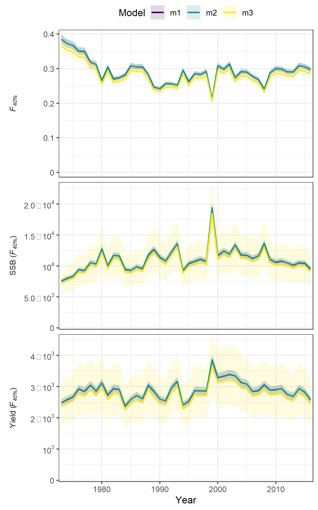

layout: true

.footnote[U.S. Department of Commerce | National Oceanic and Atmospheric Administration | National Marine Fisheries Service]


<style type="text/css">

code.cpp{
  font-size: 14px;
}
code.r{
  font-size: 14px;
}


</style>

```{css, echo=FALSE}
pre {
  max-height: 250px; /*changes height of chunk output box*/
  max-width: 800px; /*changes width of chunk output box*/
  overflow-y: auto; /* auto will add vertical scroll bar when necessary */
}

```
```{r set-options, include = FALSE}
options(width = 50)
```

```{r xaringan-tile-view, echo=FALSE}
# this gives you a tile navigation if you type "O" at any time
#xaringanExtra::use_tile_view()
```

---

# Outline <br>

* Using `compare_wham_models`
* Model evaluation information from `plot_wham_output` from:
 * Retros
 * Residuals OSA and otherwise
 * joint likelihood components
* Using `jitter_wham` (beta)
* Using `self_test` (beta)

---

# `compare_wham_models`

This function will take a list of fitted models and generate several comparison plots and table of AIC and Mohn's $\rho$.
The arguments to this function are:
* `mods`: list of models fitted using WHAM
* `do.table`: produce table of AIC and Mohn's $\rho$ values (default is TRUE)
* `do.plot`: produce the comparitive plots (default is TRUE)
* `fdir`: directory where to save comparison plots and tables
* `compare.opts`: list of options to direct which results to create
 * `stock`: Which stock to make results for (default = 1)
 * `region`: Which retion to make results for (default = 1)
* `table.opts`: list of options to direct table results (lots of options)
* `plot.opts`: list of options to direct plot results (lots of options)

---

# `compare_wham_models`

First let's add more results to a few fits from yesterday, then compare them using `compare_wham_models`
```{r, include = FALSE}
library("wham", lib.loc = "c:/work/wham/old_packages/lab")
```

```{r, eval = FALSE}
library(wham)
fit_4 <- readRDS(file.path("temp", "day_2_2_fit_4.RDS"))
fit_5 <- readRDS(file.path("temp", "day_2_2_fit_5.RDS"))
fit_6 <- readRDS(file.path("temp", "day_2_2_fit_6.RDS"))
fit_4$peels <- retro(fit_4)
fit_5$peels <- retro(fit_5)
fit_6$peels <- retro(fit_6)

fit_4 <- make_osa_residuals(fit_4)
fit_5 <- make_osa_residuals(fit_5)
fit_6 <- make_osa_residuals(fit_6)
```

```{r, include = FALSE}
fit_4 <- readRDS(file.path("../temp", "day_3_1_fit_4.RDS"))
fit_5 <- readRDS(file.path("../temp", "day_3_1_fit_5.RDS"))
fit_6 <- readRDS(file.path("../temp", "day_3_1_fit_6.RDS"))
```

```{r, eval = FALSE}
tmp.dir <- tempdir(check=TRUE)
res <- compare_wham_models(list(fit_4,fit_5,fit_6), fdir = tmp.dir)
```

---

# `compare_wham_models`

.pull-left[
Various plots are produced including these:
```{r, echo = FALSE, out.width="100%", fig.align="center"}

```
]

.pull-right[
```{r, echo = FALSE, out.width="70%", fig.align="center"}

```
]

---

# `compare_wham_models`


.pull-left[
And reference points:
```{r, echo = FALSE, out.width="70%", fig.align="center"}

```
]

.pull-right[
```{r, echo = FALSE, out.width="70%", fig.align="center"}

```
]

---

# Diagnostics from `plot_wham_output`

.pull-left[
The traditional components of the joint negative log-likelihood:
```{r, echo = FALSE, out.width="80%", fig.align="center"}

```
]

.pull-right[
Comparisons of observed and predicted age comp
```{r, echo = FALSE, out.width="80%", fig.align="center"}

```
]


---

# Diagnostics from `plot_wham_output`

.pull-left[
The traditional bubble plots for age comp:
```{r, echo = FALSE, out.width="80%", fig.align="center"}

```
]

.pull-right[
And bubble plots for age comp one-step-ahead residuals:
```{r, echo = FALSE, out.width="80%", fig.align="center"}

```
]

---

# Diagnostics from `plot_wham_output`

More summary plots for OSA residuals
.pull-left[
Aggregate observations
```{r, echo = FALSE, out.width="80%", fig.align="center"}

```
]

.pull-right[
And for age comp:
```{r, echo = FALSE, out.width="80%", fig.align="center"}

```
]


---

# Diagnostics from `plot_wham_output`

And retro plots

.pull-left[
```{r, echo = FALSE, out.width="80%", fig.align="center"}

```
]

.pull-right[
```{r, echo = FALSE, out.width="80%", fig.align="center"}

```
]

---

# `jitter_wham` (Beta)

This function will take a fitted model and refit the model a number of times with alternative starting values
The arguments to this function are:
* `fit_RDS`: The RDS file name for a saved WHAM model
* `n_jitter`: number of refits of the model to perform (default is 10)
* `intial_values`: (optional) matrix of starting values to use for refitting the model
* `which_rows`: (optional) subset of rows of `initial_values` to refit. Helpful for restarting jitter project.
* `do_parallel`: whether to do jitter fits in parallel. requires the `snowfall` package
* `n_cores`: number of cores to use for parallel computation. Default is half the available cores.
* `res_dir`: directory where the function will save individual files for each jitter fit.
* `wham_location`: (optional) location of WHAM package to use.

---

# `jitter_wham` (Beta)

Here we use the `jitter_wham` function to create the default number of initial parameter vectors and refit the model for each

.pull-left[
The fitted model is saved as an RDS prior to calling `jitter_wham`.
```{r, eval = FALSE}
jitter_res <- jitter_wham(fit_RDS = file.path("temp", "day_3_1_fit_6.RDS"), 
  n_jitter = 10, res_dir = "temp", do_parallel = FALSE)

fit_6 <- readRDS(file.path("temp", "day_3_1_fit_6.RDS"))
plot(1:10, sapply(jitter_res[[1]], function(x) x$obj) - fit_6$opt$obj, xlab = "Jitter #", ylab = "NLL Difference")
```
]

.pull-right[
```{r, echo = FALSE, out.width="90%", fig.align="center"}
jitter_res <- readRDS(file.path("../temp", "day_3_1_jitter_res.RDS"))
plot(1:10, sapply(jitter_res[[1]], function(x) x$obj) - fit_6$opt$obj, xlab = "Jitter #", ylab = "NLL Difference")
```
]

---

# `self_test` (Beta)

This function will take a fitted model and simulate a number of new data sets and refit the model to each simulated data set
The arguments to this function are:
* `fit_RDS`: The RDS file name for a saved WHAM model
* `n`: number of refits of the model to perform (default is 10)
* `seeds`: (optional) vector of seeds to set for simulating each data set. Helpful for reproducability.
* `which_seeds`: (optional) subset of `seeds` to use. Helpful for restarting project.
* `conditional`: T/F whether to fix rather than simulate random effects. Default = TRUE
* `map_change`: to use alternative assumptions about estimation for particular parameters.
* `do_parallel`: whether to do simulation/fits in parallel. requires the `snowfall` package
* `n_cores`: number of cores to use for parallel computation. Default is half the available cores.
* `res_dir`: directory where the function will save individual files for each simulation/fit.
* `wham_location`: (optional) location of WHAM package to use.

---

# `self_test` (Beta)

Here we use the `self_test` function to create the default number of initial parameter vectors and refit the model for each

.pull-left[
The fitted model is saved as an RDS prior to calling `self_test`.
```{r, eval = FALSE}
self_test_res <- self_test(fit_RDS = file.path("temp", "day_3_1_fit_6.RDS"), 
  n = 10, res_dir = "temp", do_parallel = FALSE)

fit_6 <- readRDS(file.path("temp", "day_3_1_fit_6.RDS"))
true = fit_6$rep$SSB
est = sapply(self_test_res[[1]], function(x) return(x$SSB))
SSB_rel_resid = apply(est,2, function(x) x/true - 1)
resid_cis = apply(SSB_rel_resid,1,mean) + apply(SSB_rel_resid,1,sd)*qnorm(0.975)*t(matrix(c(-1,1),2,length(true)))/sqrt(10)
plot(fit_6$years, apply(SSB_rel_resid,1,mean), ylab = "Estimated Relative Bias SSB", xlab = "Year")
lines(fit_6$years, resid_cis[,1])
lines(fit_6$years, resid_cis[,2])
abline(h = 0, lty = 2)
```
]

.pull-right[
```{r, echo = FALSE, out.width="90%", fig.align="center"}
self_test_res <- readRDS(file.path("../temp", "day_3_1_self_test_res.RDS"))
true = fit_6$rep$SSB
est = sapply(self_test_res[[1]], function(x) return(x$SSB))
SSB_rel_resid = apply(est,2, function(x) x/true - 1)
resid_cis = apply(SSB_rel_resid,1,mean) + apply(SSB_rel_resid,1,sd)*qnorm(0.975)*t(matrix(c(-1,1),2,length(true)))/sqrt(10)
plot(fit_6$years, apply(SSB_rel_resid,1,mean), ylab = "Estimated Relative Bias SSB", xlab = "Year")
lines(fit_6$years, resid_cis[,1])
lines(fit_6$years, resid_cis[,2])
abline(h = 0, lty = 2)
```
]

