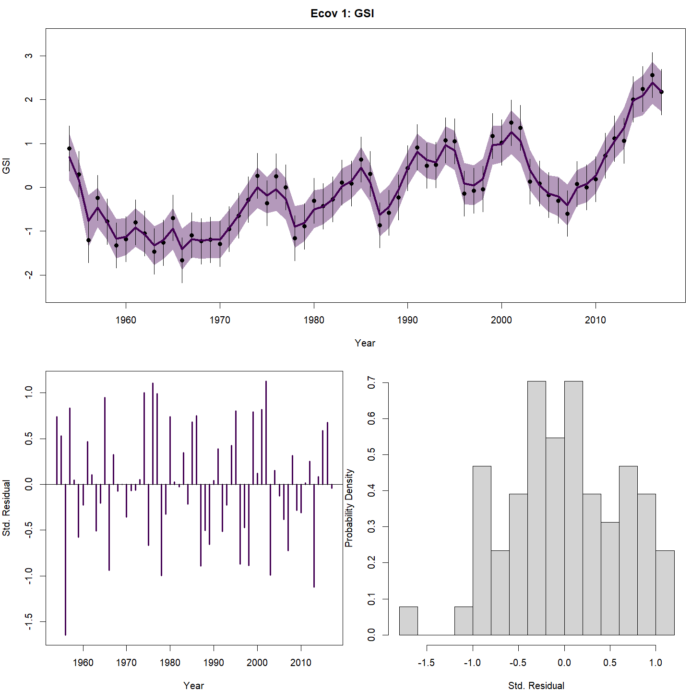
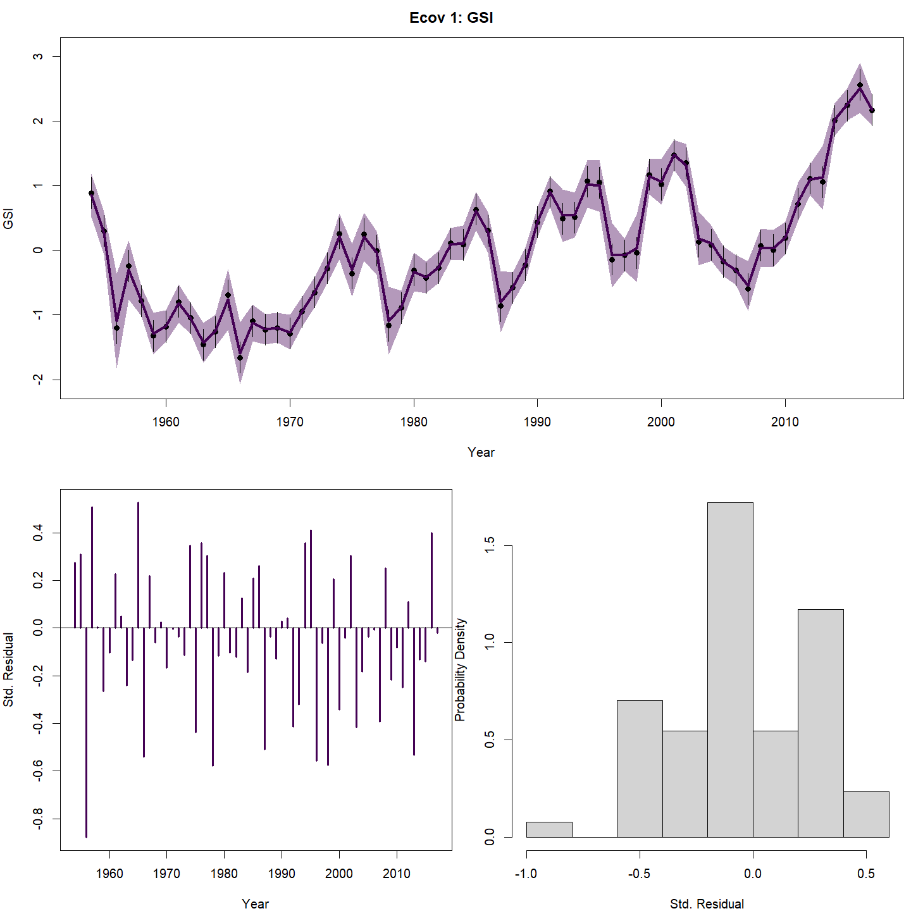

layout: true

.footnote[U.S. Department of Commerce | National Oceanic and Atmospheric Administration | National Marine Fisheries Service]


<style type="text/css">

code.cpp{
  font-size: 14px;
}
code.r{
  font-size: 14px;
}


</style>

```{css, echo=FALSE}
pre {
  max-height: 250px; /*changes height of chunk output box*/
  max-width: 800px; /*changes width of chunk output box*/
  overflow-y: auto; /* auto will add vertical scroll bar when necessary */
}

```
```{r set-options, include = FALSE}
options(width = 50)
```

```{r xaringan-tile-view, echo=FALSE}
# this gives you a tile navigation if you type "O" at any time
#xaringanExtra::use_tile_view()
```

---

# Outline <br>

* Using `set_ecov`
* Using different options with WHAM example data:
 * Different options for observations
 * Different options for process error random effects
 * Effects on different model parameters
  * Recruitment
  * M
  * catchability

---

# Environmental covariate effects

The `ecov` argument to `prepare_wham_input` or `set_ecov` has these elements to configure environmental effects on the population.
* `label`: names for covariates
* `mean`: matrix of covariate observations (n_years x n_covariates)
* `logsigma`: configuration of covariate observation error:
 * 1) matrix of the log(sd) for each covariate observations (n_years x n_covariates)
 * 2) vector of single constant observation log(sd) for each covariate
 * 3) `est_1`: Estimate a constant observation sd for each covariate
 * 4) `est_re`: Estimate a normally distributed random effect (mean and sd) for the log(sd) for each covariate
 * 5) a list with two elements where the first is 1 or 2 and the second is 3 or 4.
* `year`: years corresponding to the rows of `mean`
* `use_obs`: T/F (matrix) on whether to use the observations for each covariate.
* `process_model`: `rw` (random walk), `ar1`, or `NA` (do not fit)
* `process_mean_vals`,`process_sig_vals`,`process_cor_vals`: intial values for process distribution parameters

---

# Environmental covariate effects

* `recruitment_how`: character strings ("type-lag-order") configuring the effect type for each covariate on recruitment
 * type: 'none': no effect (but still estimate the state-space model for the covariate and observation)
 * type: `controlling`,`limiting`,`lethal`,`masking`,`directive` different effects on S-R function
 * lag: `lag-0`, `lag-1`,...
 * order: `linear` = `poly-1`, `poly-2`,... 
 * e.g.: "limiting-lag-1-poly-2" would model the covariate would have a limiting affecting recruitment the next year (lag = 1) as a second order orthogonal polynomial ($b_0 + b_1*ecov + b_2*ecov^2$)
* `M_how`: character strings ("lag-order") for effect on natural mortality
* `M_effect_map`: integer array indicating which estimated effects are common by age,stock,region
* `q_how`: character strings ("lag-order") for effect on catchability
* `move_how`: character strings ("lag-order") for effect on movement
* `move_effect_map`: integer array indicating which estimated effects are common by age,stock,region,season
* `beta_R_vals`,`beta_M_vals`,`beta_q_vals`,`beta_mu_vals`: initial effect sizes

---

# Fitting efects on recruitment

First, load up some data, including the Gulf Stream Index time series provided with WHAM.
```{r, include = FALSE}
library("wham", lib.loc = "c:/work/wham/old_packages/lab")
wham.dir <- find.package("wham")
```
```{r, eval = FALSE}
library("wham")
wham.dir <- find.package("wham")
path_to_examples <- system.file("extdata", package="wham")
asap3 <- read_asap3_dat(file.path(path_to_examples,"ex1_SNEMAYT.dat"))
env.dat <- read.csv(file.path(path_to_examples,"GSI.csv"), header=T)
tmp.dir <- tempdir(check=TRUE)
```

Next, set up and fit a base model that includes the state-space model for the GSI, but no effects on the population
```{r, eval = FALSE}
NAA_re <- list(
  sigma = "rec+1", 
  cor = "iid", 
  recruit_model = 3)# Bev Holt recruitment

ecov <- list(
  label = "GSI",
  mean = as.matrix(env.dat$GSI),
  logsigma = 'est_1', # estimate obs sigma, 1 value shared across years
  year = env.dat$year,
  use_obs = matrix(1, ncol=1, nrow=dim(env.dat)[1]), # use all obs (=1)
  process_model = 'ar1', # "rw" or "ar1"
  recruitment_how = matrix("none")) # n_Ecov x n_stocks

selectivity <- list(model = rep("logistic", 3))
selectivity$initial_pars <- list(
  c(3, 0.2), 
  c(3, 0.2), 
  c(3, 0.2)) 

input_0 <- prepare_wham_input(asap3, recruit_model = 3, 
  NAA_re = NAA_re, 
  selectivity = selectivity,
  ecov=ecov,
  age_comp = "logistic-normal-miss0") # logistic normal, treat 0 obs as missing

fit_0 <- fit_wham(input_0, do.sdrep = FALSE, do.retro = FALSE, do.osa = FALSE)
fit_0 <- do_sdreport(fit_0)
fit_0$peels <- retro(fit_0)
fit_0 <- make_osa_residuals(fit_0)
plot_wham_output(fit_0, dir.main = tmp.dir)
```
---

# Fitting efects on recruitment

Diagnostics of the GSI index
.pull-left[
```{r, echo = FALSE, out.width="95%", fig.align="center"}
knitr::include_graphics("day_3_2_fit_0_GSI_diagnostic.png")
```
]

.pull-right[
```{r, echo = FALSE, out.width="95%", fig.align="center"}
knitr::include_graphics("day_3_2_fit_0_GSI_osa.png")
```
]

---

# Fitting efects on recruitment

.pull-left[
With effect of GSI on rectruitment check: 
* sd of recruitment random effects
* observation sd for GSI

]

.pull-right[
```{r, echo = FALSE, out.width="100%", fig.align="center"}

```
]

---

# Fitting efects on recruitment

Now chage the model to include a limiting effect (affects maximum recruitment) of the GSI
```{r, eval = FALSE}

ecov_1 <- ecov
ecov_1$recruitment_how <- matrix("limiting-lag-1-linear")

input_1 <- set_ecov(input_0, ecov_1)
fit_1 <- fit_wham(input_1, do.sdrep = FALSE, do.retro = FALSE, do.osa = FALSE)
fit_1 <- do_sdreport(fit_1)
fit_1$peels <- retro(fit_1)
fit_1 <- make_osa_residuals(fit_1)
plot_wham_output(fit_1, dir.main = tmp.dir)
```
---

# Fitting efects on recruitment

Diagnostics of the GSI index
.pull-left[
```{r, echo = FALSE, out.width="95%", fig.align="center"}

```
]

.pull-right[
```{r, echo = FALSE, out.width="95%", fig.align="center"}

```
]

---

# Fitting efects on recruitment

.pull-left[
With effect of GSI on rectruitment check: 
*  effect size
* sd of recruitment random effects compared to null
* observation sd for GSI compared to null
]

.pull-right[
```{r, echo = FALSE, out.width="110%", fig.align="center"}

```
]

---

# Fitting efects on recruitment

```{r, echo = FALSE, out.width="50%", fig.align="center"}

```

---

# Fitting efects on M

Set up input and fit model with:
* no recruitment or natural mortality effects
* iid random effects on natural mortality

```{r, eval = FALSE}
ecov_2 <- list(
  label = "GSI",
  mean = as.matrix(env.dat$GSI),
  logsigma = 'est_1', # estimate obs sigma, 1 value shared across years
  year = env.dat$year,
  use_obs = matrix(1, ncol=1, nrow=dim(env.dat)[1]), # use all obs (=1)
  process_model = "ar1", # "rw" or "ar1"
  M_how = array("none",c(1,1,6,1))) # n_Ecov x n_stocks x n_ages x n_regions

M <- list(
  initial_means = array(0.2, c(1,1,6)), 
  re_model = matrix("iid_ay", 1,1),
  means_map = array(NA, c(1,1,6))
)

input_2 <- set_ecov(input_0, ecov_2)
input_2 <- set_M(input_2, M)
fit_2 <- fit_wham(input_2, do.sdrep = FALSE, do.retro = FALSE, do.osa = FALSE)
fit_2 <- do_sdreport(fit_2)
fit_2$peels <- retro(fit_2)
fit_2 <- make_osa_residuals(fit_2)
plot_wham_output(fit_2, dir.main = tmp.dir)
```
---

# Fitting efects on M

Check diagnostics of the GSI index again without effects
.pull-left[
```{r, echo = FALSE, out.width="95%", fig.align="center"}
knitr::include_graphics("day_3_2_fit_2_GSI_diagnostic.png")
```
]

.pull-right[
```{r, echo = FALSE, out.width="95%", fig.align="center"}

```
]

---

# Fitting efects on M

.pull-left[
Without effect of GSI on M check: 
* sd of M Random effects
* observation sd for GSI
]

.pull-right[
```{r, echo = FALSE, out.width="110%", fig.align="center"}

```
]

---

# Fitting efects on M

Change input to include effect of GSI on M at all ages

```{r, eval = FALSE}
ecov_3 <- ecov_2
ecov_3$M_how[] <- "lag-0-linear"

input_3 <- set_ecov(input_2, ecov_3)
fit_3 <- fit_wham(input_3, do.sdrep = FALSE, do.retro = FALSE, do.osa = FALSE)
fit_3 <- do_sdreport(fit_3)
fit_3$peels <- retro(fit_3)
fit_3 <- make_osa_residuals(fit_3)
plot_wham_output(fit_3, dir.main = tmp.dir)
```
---

# Fitting efects on M

Check diagnostics of the GSI index again with effects
.pull-left[
```{r, echo = FALSE, out.width="95%", fig.align="center"}

```
]

.pull-right[
```{r, echo = FALSE, out.width="95%", fig.align="center"}

```
]

---

# Fitting efects on M

.pull-left[
With effect of GSI on M check: 
*  effect size
* sd of M Random effects compared to null
* observation sd for GSI compared to null
]

.pull-right[
```{r, echo = FALSE, out.width="110%", fig.align="center"}

```
]

---

# Fitting efects on M

```{r, echo = FALSE, out.width="50%", fig.align="center"}

```

---

# Fitting efects on recruitment and M

Change input to include effect of GSI on recruitment as well

```{r, eval = FALSE}
ecov_4 <- ecov_3
ecov_4$recruitment_how <- matrix("limiting-lag-1-linear")

input_4 <- set_ecov(input_3, ecov_4)
fit_4 <- fit_wham(input_4, do.sdrep = FALSE, do.retro = FALSE, do.osa = FALSE)
```
```{r, include = FALSE}
fit_4 <- readRDS(file.path("../temp", "day_3_2_fit_4_no_conv.RDS"))
```
Starting at default values gives unconverged optimization
```{r}
max(abs(fit_4$final_gradient))
```

---

# Fitting efects on recruitment and M

But if we start out model at MLEs from fit_3, converges fine:
```{r, eval = FALSE}
#a rough check that all parameter elements have the same size.
all(sort(sapply(input_3$par, length)) == sort(sapply(input_4$par, length)))

#start at good initial values
input_4$par <- fit_3$parList
fit_4 <- fit_wham(input_4, do.sdrep = FALSE, do.retro = FALSE, do.osa = FALSE)
```
```{r, include = FALSE}
fit_4 <- readRDS(file.path("../temp", "day_3_2_fit_4.RDS"))
```
```{r}
max(abs(fit_4$final_gradient))
```

---

# Fitting efects on recruitment and M

.pull-left[
With effect of GSI on rectruitment and M check: 
*  effect size for R and M
* sd of recruitment random effects compared to null
* sd of M random effects compared to null
]

.pull-right[
```{r, echo = FALSE, out.width="110%", fig.align="center"}

```
]

---

# Fitting efects on recruitment and M

.pull-left[
```{r, echo = FALSE, out.width="100%", fig.align="center"}

```
]

.pull-left[
```{r, echo = FALSE, out.width="100%", fig.align="center"}

```
]

---

# Fitting efects on recruitment and M

.pull-left[
```{r, eval = FALSE}
comp_mods <- compare_wham_models(list(fit_0,fit_1,fit_2,fit_3,fit_4), fdir = tmp.dir)
```
```{r, echo = FALSE}
readRDS(file.path("../temp", "day_3_2_comp_mods_1.RDS"))$tab
```
]
.pull-right[
```{r, echo = FALSE, out.width="70%", fig.align="center"}

```
]
---

# Fitting efects on catchability

Change input to exclue any GSI effects, but include random effects on catchability for the first index.
```{r, eval = FALSE}
catchability <- list(
  re = c("iid", "none")
)
input_5 <- set_q(input_0, catchability)
fit_5 <- fit_wham(input_5, do.sdrep = FALSE, do.retro = FALSE, do.osa = FALSE)
fit_5 <- do_sdreport(fit_5)
fit_5$peels <- retro(fit_5)
fit_5 <- make_osa_residuals(fit_5)
plot_wham_output(fit_5, dir.main = tmp.dir)
```

---

# Fitting efects on catchability

Check diagnostics of the GSI index again with effects
.pull-left[
```{r, echo = FALSE, out.width="95%", fig.align="center"}

```
]

.pull-right[
```{r, echo = FALSE, out.width="95%", fig.align="center"}
knitr::include_graphics("day_3_2_fit_5_GSI_osa.png")
```
]

---

# Fitting efects on catchability

.pull-left[
With effect of GSI on M check: 
* sd of q Random effects
* observation sd for GSI
]

.pull-right[
```{r, echo = FALSE, out.width="110%", fig.align="center"}

```
]

---

# Fitting efects on catchability

Change input to include effect of GSI on catchability for the first index

```{r, eval = FALSE}
ecov_5 <- ecov
ecov_5$q_how  <- matrix(c("lag-0-linear", "none"),1,2)
input_6 <- set_ecov(input_5, ecov_5)
fit_6 <- fit_wham(input_6, do.sdrep = FALSE, do.retro = FALSE, do.osa = FALSE)

fit_6 <- do_sdreport(fit_6)
fit_6$peels <- retro(fit_6)
fit_6 <- make_osa_residuals(fit_6)
plot_wham_output(fit_6, dir.main = tmp.dir)
```
---

# Fitting efects on catchability

Check diagnostics of the GSI index again with effects
.pull-left[
```{r, echo = FALSE, out.width="95%", fig.align="center"}

```
]

.pull-right[
```{r, echo = FALSE, out.width="95%", fig.align="center"}

```
]

---

# Fitting efects on catchability

.pull-left[
With effect of GSI on M check: 
*  effect size
* sd of q Random effects compared to null
* observation sd for GSI compared to null
]

.pull-right[
```{r, echo = FALSE, out.width="110%", fig.align="center"}

```
]

---

# Fitting efects on catchability

Compare annual catchability with and without GSI effects
.pull-left[
```{r, echo = FALSE, out.width="95%", fig.align="center"}

```
]

.pull-right[
```{r, echo = FALSE, out.width="95%", fig.align="center"}
knitr::include_graphics("day_3_2_fit_6_q.png")
```
]

---

# Fitting efects on catchability

.pull-left[
```{r, eval = FALSE}
comp_mods <- compare_wham_models(list(fit_5,fit_6), fdir = tmp.dir)
```
```{r, echo = FALSE}
readRDS(file.path("../temp", "day_3_2_comp_mods_2.RDS"))$tab
```
]
.pull-right[
```{r, echo = FALSE, out.width="70%", fig.align="center"}

```
]