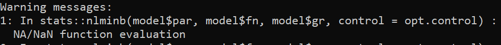

layout: true

.footnote[U.S. Department of Commerce | National Oceanic and Atmospheric Administration | National Marine Fisheries Service]


<style type="text/css">

code.cpp{
  font-size: 14px;
}
code.r{
  font-size: 14px;
}


</style>

```{css, echo=FALSE}
pre {
  max-height: 250px; /*changes height of chunk output box*/
  max-width: 800px; /*changes width of chunk output box*/
  overflow-y: auto; /* auto will add vertical scroll bar when necessary */
}

```
```{r set-options, include = FALSE}
options(width = 50)
```

```{r xaringan-tile-view, echo=FALSE}
# this gives you a tile navigation if you type "O" at any time
#xaringanExtra::use_tile_view()
```

---

# Outline <br>

* An example where there is a bad data value (see WHAM vignette 7)
* May need to re-specify index CVs and input effective sample size
* Helping your model converge
---

# NA Model function evaluation

Load the problematic ASAP file
```{r eval=FALSE}
library(wham)
wham.dir <- find.package("wham")
asap3 <- read_asap3_dat(file.path(wham.dir,"extdata","ex7_SNEMAYT.dat"))
input <- prepare_wham_input(asap3, recruit_model=2, model_name="Ex 1: SNEMA Yellowtail Flounder",
                              NAA_re = list(sigma="rec+1", cor="iid"))
```
```{r, include = FALSE}
library("wham", lib.loc = "c:/work/wham/old_packages/lab")
wham.dir <- find.package("wham")
asap3 <- read_asap3_dat(file.path(wham.dir,"extdata","ex7_SNEMAYT.dat"))
input <- prepare_wham_input(asap3, recruit_model=2, model_name="Ex 1: SNEMA Yellowtail Flounder",
                              NAA_re = list(sigma="rec+1", cor="iid"))
```

---

# NA Model function evaluation

```{r error=TRUE}
mod <- fit_wham(input, do.osa = F, do.retro = F)
```

---

# NA Model function evaluation

Use `do.fit = FALSE`
.pull-left[
```{r include = FALSE}
mod <- fit_wham(input, do.fit = F)
```
```{r eval = FALSE}
mod <- fit_wham(input, do.fit = F)
```
```{r}
mod$fn()
rep <- mod$rep
nlls <- grep("nll", names(rep), value = TRUE)
nlls
```
]
.pull-right[
```{r}
sapply(nlls, function(x) sum(rep[[x]]))
```
]
---

# NA Model function evaluation

```{r}
rep$nll_agg_catch
```
* Year 42 is the problem!
---

# NA Model function evaluation

* evaluating the nll requires (from inspecting WHAM c++ code)
 * `agg_catch`  (the catch data)
 * `agg_catch_sigma` (log-catch sd)
 * `pred_log_catch` (model-predicted log-catch), 
 * `log_catch_sig_scale` (scalar parameter for log-catch sd)

```{r}
input$data$agg_catch[42,]
```
---

# NA Model function evaluation

```{r}
input$data$agg_catch_sigma[42,]
input$par$log_catch_sig_scale
```

---

# NA Model function evaluation
* The only thing left is `pred_log_catch` which (from inspecting WHAM c++ code) is a function of
 * predicted catch numbers at age
 * catch weight at age

```{r}
rep$pred_stock_CAA[1,1,42,]
rep$waa_catch[1,42,] 
```
**It's the weight at age 1!**

---

# The nlminb warning

* A common console print after fitting a model is this: 
```{r, echo = FALSE, out.width="90%", fig.align="center"}

```
* However, this only means that during the optimization the search temporarily entered somewhere in the parameter space that resulted in a  NA for the nll function evaluation.

---

# Index CV and Age comp input sample size

* Previous ASAP models have often reweighted age comp sample sizes and/or the assumed CV for the aggregate indices
* Modeling process errors in WHAM explicitly implies that these inputs should be re-examined.
* If using Dirichlet-multinomial likelihoods for age comp, the input sample size should be an upper bound (e.g., the number of age measurements)
 * a dispersion parameter is estimated which can equate to a multinomial sample size between 1 and the upper bound.

---


# Helping your model converge

When a fit doesn't converge
* it is often one of these two things:
    * 1) the data cannot reliably estimate the assumed level of complexity
        * Including too many sources of process error can result in variance parameter estimation going to zero which will result in poor convergence.
    * 2) the starting values have not led to the global minimum
        * using `jitter_wham` with user-supplied starting values might improve success
        * using MLEs from a simpler model can also help
* running `check_convergence` may help determine which parameter is problematic
    * it is often selectivity and/or initial NAA parameters!
