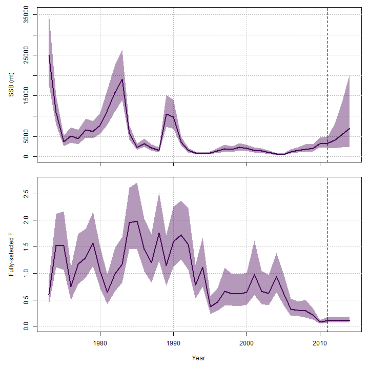

layout: true

.footnote[U.S. Department of Commerce | National Oceanic and Atmospheric Administration | National Marine Fisheries Service]


<style type="text/css">

code.cpp{
  font-size: 14px;
}
code.r{
  font-size: 14px;
}


</style>

```{css, echo=FALSE}
pre {
  max-height: 200px; /*changes height of chunk output box*/
  max-width: 800px; /*changes width of chunk output box*/
  overflow-y: auto; /* auto will add vertical scroll bar when necessary */
}

```
```{r set-options, include = FALSE}
options(width = 50)
```

```{r xaringan-tile-view, echo=FALSE}
# this gives you a tile navigation if you type "O" at any time
#xaringanExtra::use_tile_view()
```

---

# Outline <br>

* Using `basic_info` argument to `prepare_wham_input`
* Using different reference point configuration tools
* Using `project_wham`
* Using different projection options
---

# Reference point options

Configuring reference point calculations and projections is probably the most complicated and messy part of WHAM
* WHAM calculates reference points both 
    * annually (in model and projection years) 
    * under prevailing conditions (`static` in the names of the reported output)
* Annual SPR- and MSY-based reference points use annual inputs to SSB and yield per recruit calculations, but there are different options to treat recruitment in different ways for SSB and yield at SPR-based F (e.g., F40).
* For prevailing reference points, the user can specify which year(s) to average over for inputs to SSB/R and Y/R and how recruitment is treated.

---

# Reference point options

The `basic_info` argument to `prepare_wham_input` has these elements to configure SPR-based reference points.
* `basic_info$percentSPR`: percentage (0-100) of unfished SSB/R to use for SPR-based reference points (0-100)
* `basic_info$XSPR_input_average_years`: which years to average inputs to per recruit calculation (selectivity, M, WAA, maturity) for prevailing MSY- and SPR-based reference points. Default is last 5 years.
* `basic_info$XSPR_R_avg_yrs`: which years to average annual recruitments for SSB and Yield at SPR-based F. Default is all data years.
* `basic_info$XSPR_R_opt`: whether to use annual estimated or expected recruitments. 
    * Expected recruitment is constant over years without SR model
---

# Reference point examples
```{r, include = FALSE}
library("wham", lib.loc = "c:/work/wham/old_packages/lab")
path_to_examples <- system.file("extdata", package="wham")
asap3 <- read_asap3_dat(file.path(path_to_examples,"ex2_SNEMAYT.dat"))
env.dat <- read.csv(file.path(path_to_examples, "CPI.csv"), header=T)
```

Here we will set up alternative reference point configurations for an otherise identical model

First, read in the SNEMA yellowtail data and the Cold Pool Index.
```{r, eval = FALSE}
library("wham")
path_to_examples <- system.file("extdata", package="wham")
asap3 <- read_asap3_dat(file.path(path_to_examples,"ex2_SNEMAYT.dat"))
env.dat <- read.csv(file.path(path_to_examples, "CPI.csv"), header=T)
```

We specify an AR1 process for the CPI and limiting effects on the Beverton-Holt stock-recruit function.
```{r}
env <- list(
  label = "CPI",
  mean = as.matrix(env.dat$CPI), # CPI observations
  logsigma = as.matrix(log(env.dat$CPI_sigma)), # CPI standard error is given/fixed as data
  year = env.dat$Year,
  use_obs = matrix(1, ncol=1, nrow=dim(env.dat)[1]), # use all obs (=1)
  process_model = "ar1", # fit CPI as AR1 process
  recruitment_how = matrix("limiting-lag-1-linear")) # limiting (carrying capacity), CPI in year t affects recruitment in year t+1
```
---

# Reference point example 1

The first reference point configuration assumes
* Annual recruitment used for annual reference points
* SPR-based reference points for 50% of unfished SSB/R
* There is an average over last 10 years for something?

```{r}
basic_info <- list(
  XSPR_R_avg_yrs = tail(1:asap3[[1]]$dat$n_years, 10),
  percentSPR = 50,
  XSPR_input_average_years = tail(1:asap3[[1]]$dat$n_years, 10),
  XSPR_R_opt = 1 # use annual R estimates for annual SSB_XSPR
)
```
---

# Reference point example 1

Create the model input (random effects on R and survival)
```{r, include = FALSE}
input_1 <- prepare_wham_input(asap3, recruit_model = 3,
  ecov = env,
  NAA_re = list(sigma="rec+1", cor="iid"),
  age_comp = "logistic-normal-pool0", basic_info = basic_info) 
input_1$par$logit_selpars[1:4,7:8] <- 0 
```
```{r, eval = FALSE}
input_1 <- prepare_wham_input(asap3, recruit_model = 3,
  ecov = env,
  NAA_re = list(sigma="rec+1", cor="iid"),
  age_comp = "logistic-normal-pool0", basic_info = basic_info) 
input_1$par$logit_selpars[1:4,7:8] <- 0 
```
```{r}
input_1$data$percentSPR
input_1$data$avg_years_ind
input_1$data$XSPR_R_avg_yrs
tail(1:length(input_1$years),10)-1 #C++ starts at 0
input_1$data$XSPR_R_opt
```
---

# Reference point example 1

Fit the model
```{r, eval = FALSE}
mod_1 <- fit_wham(input_1, do.sdrep = FALSE, do.osa = FALSE, do.retro = FALSE) 
```
```{r, include = FALSE}
mod_1 <- readRDS(file.path("../temp", "day_4_2_mod_1.RDS"))
```
The annual recruitments used to fill out `R_XSPR`
```{r}
cbind(mod_1$rep$R_XSPR, mod_1$rep$NAA[1,1,,1])
```
---

# Reference point example 1

The annual BRPs are indeed the product of the annual recruitments and the annual SSB/R or Y/R
```{r}
cbind(exp(mod_1$rep$log_SSB_FXSPR[,1]), mod_1$rep$NAA[1,1,,1]*exp(mod_1$rep$log_SPR_FXSPR[,1]))
```
---

# Reference point example 1

What about prevailing BRPs?

* SSB/R and Y/R uses weight-at-age, maturity, M, selectivity is averaged over last 10 years for the prevailing conditions BRPs
* supposed to use mean recruitment for the last 10 years

Recall:
```{r}
basic_info <- list(
  XSPR_R_avg_yrs = tail(1:asap3[[1]]$dat$n_years, 10),
  percentSPR = 50,
  XSPR_input_average_years = tail(1:asap3[[1]]$dat$n_years, 10),
  XSPR_R_opt = 1 # use annual R estimates for annual SSB_XSPR
)
```

---

# Reference point example 1

The prevailing BRP:
```{r}
exp(mod_1$rep$log_SSB_FXSPR_static[1])
```
Uses this for recruitment: SSB / (SSB/R) = R
```{r}
exp(mod_1$rep$log_SSB_FXSPR_static[1])/exp(mod_1$rep$log_SPR_FXSPR_static[1])
```
But the average recruitment is this
```{r}
mean(mod_1$rep$R_XSPR[tail(1:input_1$data$n_years_model,10),1])
```
Turns out, the prevailing BRP currrently just uses the last value from `R_XSPR`
```{r}
mod_1$rep$R_XSPR[input_1$data$n_years_model,1]
```
---

# Reference point example 2

The second reference point configuration assumes just changes `XSPR_R_opt=2`
* mean annual recruitment for last 10 years is supposed to be used for annual BRPs
* mean annual recruitment for the last 10 years is supposed to be used for prevailing BRPs 

We don't need to fit the model, just use the parameters already estimated.
```{r, eval = FALSE}
input_2 <- input_1
input_2$par <- mod_1$parList
input_2$data$XSPR_R_opt = 2 
mod_2 <- fit_wham(input_2, do.fit = FALSE)
```
```{r, include = FALSE}
mod_2 <- readRDS(file.path("../temp", "day_4_2_mod_2.RDS"))
input_2 <- mod_2$input
```

---

# Reference point example 2

The annual recruitments in `R_XSPR` are are all the same:
```{r}
cbind(mod_2$rep$R_XSPR, mod_2$rep$NAA[1,1,,1])
```
And equal to the mean of the last 10 years
```{r}
mean(mod_2$rep$NAA[1,1,tail(1:input_2$data$n_years_model,10),1])
```

---

# Reference point example 2

So, the annual BRPs are the product of the mean recruitment estimates and the annual SSB/R or Y/R as expected
```{r}
cbind(exp(mod_2$rep$log_SSB_FXSPR[,1]), mod_2$rep$R_XSPR[,1]*exp(mod_2$rep$log_SPR_FXSPR[,1]))
```

The prevailing conditions use the value in the last year for `$R_XSPR` which is the mean recruitment for the last 10 years
```{r}
exp(mod_2$rep$log_SSB_FXSPR_static[1])
exp(mod_2$rep$log_SSB_FXSPR_static[1])/exp(mod_2$rep$log_SPR_FXSPR_static[1])
mod_2$rep$R_XSPR[input_2$data$n_years_model,1]
```

---

# Reference point example 3

The third reference point configuration assumes just changes `XSPR_R_opt=3`
* Annual expected recruitment rather than estimated recruitment is used for annual BRPs
* Annual extected recruitment rather than estimatd recruitment is used for the average

Again, we don't need to fit the model, just use the parameters already estimated.
```{r, eval = FALSE}
input_3 <- input_2
input_3$data$XSPR_R_opt = 3 
mod_3 <- fit_wham(input_3, do.fit = FALSE)
```
```{r, include = FALSE}
mod_3 <- readRDS(file.path("../temp", "day_4_2_mod_3.RDS"))
input_3 <- mod_3$input
```

---

# Reference point example 3

.pull-left[
The annual expected recruitments are indeed used to fill out `R_XSPR`:
```{r}
cbind(mod_3$rep$R_XSPR, mod_3$rep$pred_NAA[1,1,,1])
```
]
.pull-right[
And the annual BRPs are indeed the product of the annual expected recruitment and the annual SSB/R or Y/R
```{r}
cbind(exp(mod_3$rep$log_SSB_FXSPR[,1]), mod_3$rep$R_XSPR[,1]*exp(mod_3$rep$log_SPR_FXSPR[,1]))
```
]
---

# Reference point example 3

Like `XSPR_R_opt=1`, since the prevailing conditions use the value in the last year for `$R_XSPR` it is not based on the average recruitments
```{r}
exp(mod_3$rep$log_SSB_FXSPR_static[1])
exp(mod_3$rep$log_SSB_FXSPR_static[1])/exp(mod_3$rep$log_SPR_FXSPR_static[1])
mod_3$rep$R_XSPR[input_3$data$n_years_model,1]
```

---

# Reference point example 4

The fourth reference point configuration assumes just changes `XSPR_R_opt=4`
* mean annual expected recruitment for last 10 years is supposed to be used for annual BRPs
* mean annual expected recruitment for the last 10 years is supposed to be used for prevailing BRPs 

Again, we don't need to fit the model, just use the parameters already estimated.
```{r, eval = FALSE}
input_4 <- input_2
input_4$data$XSPR_R_opt = 4 # use average expected R estimates for annual SSB_XSPR
mod_4 <- fit_wham(input_4, do.fit = FALSE)
```
```{r, include = FALSE}
mod_4 <- readRDS(file.path("../temp", "day_4_2_mod_4.RDS"))
input_4 <- mod_4$input
```

---

# Reference point example 4

The annual recruitments in `R_XSPR` are are all the same:
```{r}
cbind(mod_4$rep$R_XSPR, mod_4$rep$pred_NAA[1,1,,1])
```
And equal to the mean of the last 10 years expected recruitment
```{r}
mean(mod_4$rep$pred_NAA[1,1,tail(1:input_4$data$n_years_model,10),1])
```

---

# Reference point example 4

So, the annual BRPs are the product of the mean expected recruitment and the annual SSB/R or Y/R as expected
```{r}
cbind(exp(mod_4$rep$log_SSB_FXSPR[,1]), mod_4$rep$R_XSPR[,1]*exp(mod_4$rep$log_SPR_FXSPR[,1]))
```

And the prevailing conditions use the value in the last year for `$R_XSPR` which is also the mean expected recruitment for the last 10 years

```{r}
exp(mod_4$rep$log_SSB_FXSPR_static[1])
exp(mod_4$rep$log_SSB_FXSPR_static[1])/exp(mod_4$rep$log_SPR_FXSPR_static[1])
mod_4$rep$R_XSPR[input_4$data$n_years_model,1]
```

---

# Projection options

Relevant arguments to `basic_info`
* `basic_info$XSPR_input_average_years`: is used for both prevailing FXSPR and FMSY and that which is used in projections.

`proj.opts` argument to `project_wham` and `prepare_projection`
* `$n.yrs`: number of projection years
* `$use.FXSPR`: whether to use prevailing SPR-based F
* `$use.FMSY`: whether to use prevailing FMSY (when possible)
* `$percentFXSPR`: same as `basic_info` and redefines it.
* `$percentFMSY`: same as `basic_info` and redefines it.
* `$use.last.F`: whether to use terminal F estimate (and uncertainty)
* `$use.avg.F`: whether to use average of annual F estimates (years defined by `avg.yrs`)
* `$avg.yrs` (vector) specify which years to average over for calculating reference points or average F. Default = last 5 model years.
    * Will redefine anything defined in `prepare_wham_input`
* `$avg.rec.yrs`: specify which years to calculate the mean and sd for the normal distribution of log-recruitment in projections. Default = all model years. Only used when recruitment is estimated as fixed effects (SCAA).

---

# Projection options

`proj.opts` argument to `project_wham` and `prepare_projection` (continued)

* `$proj_mature` user-supplied maturity for the projection years. Overrides averaging over years
* `$proj_waa`} user-supplied weight-at-age for the projection years. Overrides averaging over years
* `$proj_R_opt`: (integer)
    * 1: continue any RE processes for recruitment, 
    * 2: make projected recruitment consistent with average recruitment in SPR reference points and cancel any bias correction for NAA in projection years.
* `$proj.F` (vector) user-specified annual Fs to use in projections 
* `$proj.catch` (vector), user-specified annual catches to use in projections (wham determines F internally)
* `$proj_F_opt`: Overrides any of the above specifications. (vector), integers specifying how to configure each year of the projection: 
    * 1: use terminal F
    * 2: use average F
    * 3: use SPR-based F
    * 4: use specified F
    * 5: use specified catch 
    * 6: use Fmsy
* `$proj_Fcatch`: (vector), catch or F values to use each projection year. Overrides any specifications of `proj.F` or `proj.catch`.

---

# Projection options

`proj.opts` argument to `project_wham` and `prepare_projection` (continued)

* `$cont.ecov` whether to continue environmental covariate process for projections. Default = TRUE.
* `$use.last.ecov` whether to use terminal year ecov for projections.
* `$cont.M.re`: whether to continue M random effects for projections. Default = FALSE.
* `$cont.move.re`: whether to continue any movement random effects for projections. Default = FALSE.

---

# Projection examples

First, do fit for mod_2 with sdreport

```{r, eval = FALSE}
mod_2 <- fit_wham(input_2, do.retro = FALSE, do.osa = FALSE)
```

Next we define 11 different projection configurations for this model.

First, just define the different projection options

The first projection uses all the default settings:
* 3 projection years
* use terminal year F
* continue the AR1 process for the environmental covariate

```{r, eval = FALSE}
proj_opts <- list()

# default settings: 3 years, use last F, continue ecov
proj_opts[[1]] <-list(n.yrs=3, use.last.F=TRUE, use.avg.F=FALSE,
              use.FXSPR=FALSE, proj.F=NULL, proj.catch=NULL, avg.yrs=NULL,
              cont.ecov=TRUE, use.last.ecov=FALSE, avg.ecov.yrs=NULL, proj.ecov=NULL)

# should be equal to
# proj_opts[[1]] <- list()
```
---

# Projection examples

The second assumes
* 5 projection years
* use terminal F
* ecov in projection years is  average ecov 1992-1996

```{r, eval = FALSE}
proj_opts[[2]] <- list(n.yrs=5, use.last.F=TRUE, use.avg.F=FALSE,
              use.FXSPR=FALSE, proj.F=NULL, proj.catch=NULL, avg.yrs=NULL,
              cont.ecov=FALSE, use.last.ecov=FALSE, avg.ecov.yrs=1992:1996, proj.ecov=NULL)
```

The third assumes
* 5 projection years
* use terminal F
* ecov in projection years is same as terminal year

```{r, eval = FALSE}
proj_opts[[3]] <- list(n.yrs=5, use.last.F=TRUE, use.avg.F=FALSE,
              use.FXSPR=FALSE, proj.F=NULL, proj.catch=NULL, avg.yrs=NULL,
              cont.ecov=FALSE, use.last.ecov=TRUE, avg.ecov.yrs=NULL, proj.ecov=NULL)
```

---


# Projection examples

The fourth assumes
* 5 projection years
* use terminal F
* ecov in projection years is higher ~0.5

```{r, eval = FALSE}
proj_opts[[4]] <- list(n.yrs=5, use.last.F=TRUE, use.avg.F=FALSE,
              use.FXSPR=FALSE, proj.F=NULL, proj.catch=NULL, avg.yrs=NULL,
              cont.ecov=FALSE, use.last.ecov=FALSE, avg.ecov.yrs=NULL, proj.ecov=matrix(c(0.5,0.7,0.4,0.5,0.55),ncol=1))
```

The fifth assumes
* 5 projection years
* use terminal F
* ecov in projection years is lower ~ - 1.5

```{r, eval = FALSE}
proj_opts[[5]] <- list(n.yrs=5, use.last.F=TRUE, use.avg.F=FALSE,
              use.FXSPR=FALSE, proj.F=NULL, proj.catch=NULL, avg.yrs=NULL,
              cont.ecov=FALSE, use.last.ecov=FALSE, avg.ecov.yrs=NULL, proj.ecov=matrix(c(-1.6,-1.3,-1,-1.2,-1.25),ncol=1))
```

---

# Projection examples

The sixth assumes
* 5 projection years 
* use specified annual catch in projection years
* continue the AR1 process for the environmental covariate

```{r, eval = FALSE}
proj_opts[[6]] <- list(n.yrs=5, use.last.F=FALSE, use.avg.F=FALSE,
              use.FXSPR=FALSE, proj.F=NULL, proj.catch=c(10, 2000, 1000, 3000, 20), avg.yrs=NULL,
              cont.ecov=TRUE, use.last.ecov=FALSE, avg.ecov.yrs=NULL, proj.ecov=NULL)
```

The seventh assumes
* 5 projection years 
* use specified annual F
* continue the AR1 process for the environmental covariate

```{r, eval = FALSE}
proj_opts[[7]] <- list(n.yrs=5, use.last.F=FALSE, use.avg.F=FALSE,
              use.FXSPR=FALSE, proj.F=c(0.001, 1, 0.5, .1, .2), proj.catch=NULL, avg.yrs=NULL,
              cont.ecov=TRUE, use.last.ecov=FALSE, avg.ecov.yrs=NULL, proj.ecov=NULL)
```

---

# Projection examples

The eighth assumes
* 5 projection years 
* use FXSPR
* continue the AR1 process for the environmental covariate

```{r, eval = FALSE}
proj_opts[[8]] <- list(n.yrs=5, use.last.F=FALSE, use.avg.F=FALSE,
              use.FXSPR=TRUE, proj.F=NULL, proj.catch=NULL, avg.yrs=NULL,
              cont.ecov=TRUE, use.last.ecov=FALSE, avg.ecov.yrs=NULL, proj.ecov=NULL)
```

The ninth assumes
* 5 projection years 
* use specified catch in first projection year and FXSPR afterward
* continue the AR1 process for the environmental covariate

```{r, eval = FALSE}
proj_opts[[9]] <- list(n.yrs=5, proj_F_opt =c(5,3,3,3,3), proj_Fcatch=c(300,10,10,10,10),
              cont.ecov=TRUE, use.last.ecov=FALSE)
```

---

# Projection examples

The tenth assumes
* 10 projection years 
* use average F between 1992-1996
* continue the AR1 process for the environmental covariate

```{r, eval = FALSE}
proj_opts[[10]] <- list(n.yrs=10, use.last.F=FALSE, use.avg.F=TRUE,
              use.FXSPR=FALSE, proj.F=NULL, proj.catch=NULL, avg.yrs=1992:1996,
              cont.ecov=TRUE, use.last.ecov=FALSE, avg.ecov.yrs=NULL, proj.ecov=NULL)
```

The eleventh assumes
* 5 projection years 
* use FMSY
* continue the AR1 process for the environmental covariate

```{r, eval = FALSE}
proj_opts[[11]] <- list(n.yrs=5, use.last.F=FALSE, use.avg.F=FALSE,
              use.FMSY=TRUE, proj.F=NULL, proj.catch=NULL, avg.yrs=NULL,
              cont.ecov=TRUE, use.last.ecov=FALSE, avg.ecov.yrs=NULL, proj.ecov=NULL)
```

---

# Projection examples

The do all of the projections:
```{r, eval = FALSE}
tmp.dir <- tempdir(check=TRUE)
for(i in 1:length(proj_opts)){
  mod_proj[[i]] <- project_wham(mod_2, proj.opts=proj_opts[[i]])
  plot_wham_output(mod_proj[[i]], dir.main=file.path(tmp.dir,paste0("proj_",i)))
}
```

* R script can be run for all of these
* We show results for proj_opts[c(1,9,10,11)]
    * different numbers of projection years
    * using FMSY, average F, status quo F, specified catch and F

---

# Projection examples:

.pull-left[
3 years, terminal F
```{r, echo = FALSE, out.width="100%", fig.align="center"}

```
]
.pull-right[
10 years, average F (1992-1996)
```{r, echo = FALSE, out.width="100%", fig.align="center"}

```
]
---

# Projection examples:

.pull-left[
5 years, catch, the F40
```{r, echo = FALSE, out.width="100%", fig.align="center"}

```
]
.pull-right[
5 years, Fmsy
```{r, echo = FALSE, out.width="100%", fig.align="center"}

```
]
